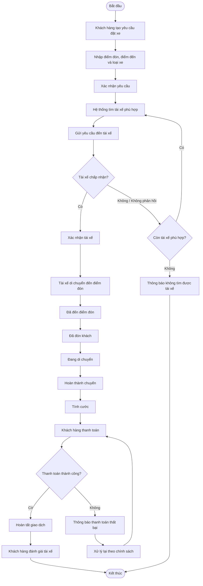
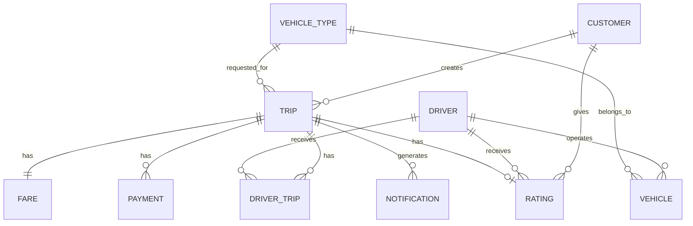
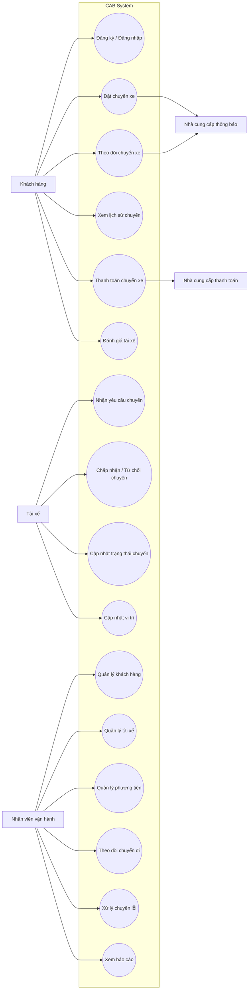

Bước 1 : đọc và phân tích yêu cầu sơ khảo của khách hàng ở giai đoạn 1 

Đúng. Với **Bước 1: Đọc và phân tích yêu cầu sơ khởi của khách hàng ở giai đoạn 1**, bạn chưa cần đi sâu vào Use Case hay thiết kế hệ thống. Mục tiêu là **đọc tình huống → bóc tách những gì khách hàng đang yêu cầu → xác định phạm vi ban đầu và những điểm cần làm rõ**.

Bạn có thể phân tích như sau:

### 1. Xác định bài toán / vấn đề hiện tại

Công ty ABC đang cung cấp dịch vụ đặt xe trực tuyến nhưng hệ thống hiện tại có các hạn chế:

* Phân công tài xế còn **thủ công**.
* Khách hàng **khó theo dõi trạng thái chuyến đi**.
* Thông tin **thanh toán chưa được quản lý tập trung**.
* Bộ phận vận hành gặp khó khăn khi **mở rộng hệ thống**.
* Hệ thống hiện tại chưa đáp ứng tốt khi số lượng khách hàng và tài xế tăng.

→ **Vấn đề kinh doanh:** ABC cần một nền tảng đặt xe mới có khả năng tự động hóa quy trình, phục vụ số lượng lớn người dùng và dễ mở rộng trong tương lai.

---

### 2. Xác định mục tiêu của hệ thống mới

Từ yêu cầu khách hàng, mục tiêu chính của CAB System là:

> Xây dựng nền tảng đặt xe trực tuyến hỗ trợ toàn bộ quy trình từ **đặt xe → tìm tài xế → thực hiện chuyến → tính cước → thanh toán → đánh giá**, đồng thời hỗ trợ quản lý vận hành và có kiến trúc linh hoạt để mở rộng.

Có thể chia thành các mục tiêu nhỏ:

| Mục tiêu               | Ý nghĩa                                  |
| ---------------------- | ---------------------------------------- |
| Đặt xe trực tuyến      | Khách hàng chủ động tạo yêu cầu          |
| Tự động tìm tài xế     | Giảm việc phân công thủ công             |
| Theo dõi chuyến đi     | Khách hàng biết trạng thái chuyến        |
| Quản lý tài xế         | Theo dõi trạng thái, phương tiện, vị trí |
| Tính cước & thanh toán | Quản lý số tiền và giao dịch             |
| Thông báo              | Cập nhật các sự kiện quan trọng          |
| Quản trị vận hành      | Nhân viên theo dõi và xử lý chuyến       |
| Báo cáo                | Theo dõi doanh thu, chuyến, hiệu quả     |
| Bảo mật                | Bảo vệ dữ liệu và kiểm soát quyền        |
| Khả năng mở rộng       | Dễ thêm dịch vụ, thanh toán, thông báo   |

---

### 3. Xác định các tác nhân chính

Khách hàng đã nêu rõ **3 nhóm người dùng chính**:

**1. Khách hàng**

* Đăng ký / đăng nhập
* Cập nhật thông tin
* Đặt xe
* Theo dõi chuyến
* Xem lịch sử
* Thanh toán
* Đánh giá tài xế

**2. Tài xế**

* Đăng ký hoặc được tạo tài khoản
* Cập nhật hồ sơ, phương tiện
* Bật trạng thái sẵn sàng
* Nhận thông báo chuyến
* Chấp nhận / từ chối chuyến
* Cập nhật trạng thái chuyến
* Cung cấp vị trí

**3. Nhân viên vận hành**

* Quản lý khách hàng
* Quản lý tài xế
* Quản lý phương tiện
* Theo dõi chuyến
* Xử lý chuyến lỗi
* Tra cứu giao dịch
* Xem báo cáo
* Thực hiện các thao tác theo quyền được cấp

Ngoài ra còn có **các hệ thống bên ngoài** cần chú ý:

* **Nhà cung cấp thanh toán bên ngoài**
* **Nhà cung cấp dịch vụ thông báo** có thể được tích hợp
* Có thể có các dịch vụ bản đồ/vị trí nếu hệ thống sử dụng để xác định khoảng cách và vị trí tài xế.

---

### 4. Xác định quy trình nghiệp vụ tổng quát

Đọc toàn bộ yêu cầu, có thể sơ bộ nhận ra quy trình chính:

**Khách hàng tạo yêu cầu đặt xe**

↓

**Hệ thống tìm tài xế phù hợp**

↓

**Tài xế nhận / từ chối chuyến**

↓

Nếu từ chối → **hệ thống tìm tài xế khác**

↓

Nếu nhận → **thông báo cho khách hàng**

↓

**Tài xế đến điểm đón**

↓

**Đón khách**

↓

**Thực hiện chuyến**

↓

**Hoàn thành chuyến**

↓

**Hệ thống tính cước**

↓

**Khách hàng thanh toán**

↓

**Đánh giá tài xế**

Đây mới là **quy trình sơ bộ**, chưa phải quy trình nghiệp vụ hoàn chỉnh vì còn nhiều quy tắc chưa được khách hàng xác định.

---

### 5. Xác định các yêu cầu chức năng sơ bộ

Từ tình huống, có thể gom thành các nhóm:

**Quản lý tài khoản**

* Đăng ký
* Đăng nhập
* Cập nhật thông tin cá nhân
* Xác thực người dùng

**Đặt xe**

* Nhập điểm đón
* Nhập điểm đến
* Chọn loại xe
* Gửi yêu cầu đặt xe

**Tìm và phân công tài xế**

* Xác định tài xế phù hợp
* Ưu tiên tài xế gần khách hàng
* Gửi yêu cầu cho tài xế
* Xử lý tài xế từ chối / không phản hồi
* Tìm tài xế tiếp theo

**Quản lý chuyến đi**

* Theo dõi trạng thái
* Cập nhật trạng thái chuyến
* Theo dõi vị trí tài xế
* Xử lý chuyến bị lỗi
* Hủy chuyến

**Tính cước & thanh toán**

* Tính số tiền phải trả
* Thanh toán tiền mặt
* Thanh toán điện tử
* Kết nối nhà cung cấp thanh toán
* Xử lý thanh toán thất bại
* Tra cứu giao dịch

**Thông báo**

* Thông báo tiếp nhận yêu cầu
* Thông báo tài xế nhận chuyến
* Thông báo tài xế đến
* Thông báo hoàn thành
* Thông báo kết quả thanh toán

**Đánh giá**

* Khách hàng đánh giá tài xế sau chuyến

**Quản trị**

* Quản lý khách hàng
* Quản lý tài xế
* Quản lý phương tiện
* Quản lý chuyến đi
* Phân quyền nhân viên
* Báo cáo

---

### 6. Xác định yêu cầu phi chức năng

Đây là phần **rất quan trọng** trong đề bài vì khách hàng nói khá nhiều về nó.

Có thể phân loại:

| Nhóm                       | Yêu cầu                                                      |
| -------------------------- | ------------------------------------------------------------ |
| Hiệu năng                  | Hoạt động ổn định khi nhu cầu tăng cao                       |
| Khả năng mở rộng           | Có thể mở rộng độc lập các thành phần                        |
| Độ tin cậy                 | Lỗi thanh toán/thông báo không làm toàn hệ thống dừng        |
| Bảo mật                    | Bảo vệ thông tin cá nhân, vị trí, giao dịch                  |
| Phân quyền                 | Kiểm soát thao tác của nhân viên                             |
| Audit                      | Lưu vết các thao tác quan trọng                              |
| Khả năng bảo trì           | Có thể thay đổi/thêm thành phần kỹ thuật                     |
| Khả năng mở rộng chức năng | Thêm dịch vụ, phương thức thanh toán, nhà cung cấp thông báo |

---

### 7. Xác định các quy tắc nghiệp vụ đã biết

Ví dụ:

* Chỉ người dùng đã được **xác thực** mới sử dụng chức năng yêu cầu tài khoản.
* Tài xế phải ở trạng thái **sẵn sàng** mới có thể nhận chuyến.
* Tài xế được lựa chọn dựa trên **vị trí, trạng thái và tiêu chí vận hành**.
* Nếu tài xế từ chối hoặc không phản hồi → hệ thống **tiếp tục tìm tài xế khác**.
* Nếu không tìm được tài xế → **thông báo cho khách hàng**.
* Sau khi chuyến hoàn thành → hệ thống **tính cước**.
* Khách hàng có thể thanh toán bằng **tiền mặt hoặc điện tử**.
* Thông tin nhạy cảm của phương thức thanh toán **không được lưu trực tiếp trong CAB**.
* Thao tác quản trị phải được **kiểm soát quyền truy cập**.

---

### 8. Quan trọng nhất: xác định những điểm CHƯA RÕ

Đây chính là phần BA cần làm ở bước tiếp theo.

Khách hàng **chưa xác định**:

1. **Cách tính cước** như thế nào?

   * Theo km?
   * Theo thời gian?
   * Theo loại xe?
   * Có phụ phí không?

2. **Tiêu chí ưu tiên tài xế**?

   * Gần nhất?
   * Thời gian chờ?
   * Đánh giá?
   * Loại xe?

3. **Tài xế phải phản hồi trong bao lâu?**

4. **Chính sách hủy chuyến**?

   * Ai được hủy?
   * Hủy trước/sau khi tài xế đến có khác nhau không?
   * Có phí hủy không?

5. **Mất kết nối mạng xử lý thế nào?**

6. **Lưu trữ dữ liệu trong bao lâu?**

7. **Thanh toán thất bại** thì cho phép thử lại bao nhiêu lần và trong thời gian nào?

8. **Quyền của từng loại nhân viên vận hành** cụ thể ra sao?

9. **Các loại xe/dịch vụ** hiện tại và tương lai gồm những gì?

10. **Nhà cung cấp thanh toán và thông báo** nào sẽ được sử dụng?

---

## Kết luận của Bước 1

Bạn có thể hiểu ngắn gọn Bước 1 theo công thức:

> **Yêu cầu khách hàng → Vấn đề → Mục tiêu → Actor → Quy trình → Chức năng → Phi chức năng → Business Rules → Điểm chưa rõ**

Và **chưa nên nhảy ngay sang thiết kế database, giao diện hay kiến trúc hệ thống**.

Đặc biệt, trong bài CAB này, BA phải chú ý rằng khách hàng **cố tình để một số yêu cầu chưa rõ**. Vì vậy, việc phát hiện ra các câu như **“cách tính cước chưa chốt”, “tiêu chí ưu tiên tài xế chưa chốt”, “chính sách hủy chưa chốt”** chính là kết quả quan trọng của giai đoạn phân tích sơ khởi.
Bước 2 : xác định các stake holder , lập bảng gồm 2 cột cột thứ nhất tên stake holder cột thứ hai là vai trò 
lập vẽ ma trận stake holder matric -> cho biết tầm quan trọng của vai trò stake holder trong hệ thống 
vẽ ma trận dùng công cụ mermaid dùng để vẽ các sơ đồ lược đồ markdown


Được. Với Bước 2, từ yêu cầu CAB System bạn đưa, ta cần xác định Stakeholder → vai trò → mức độ quan trọng.

1. Bảng Stakeholder và vai trò
| Stakeholder                         | Vai trò                                                                                               |
| ----------------------------------- | ----------------------------------------------------------------------------------------------------- |
| **Khách hàng**                      | Người sử dụng hệ thống để đăng ký, đặt xe, theo dõi chuyến, thanh toán và đánh giá tài xế.            |
| **Tài xế**                          | Nhận và thực hiện chuyến xe, cập nhật trạng thái chuyến, trạng thái hoạt động và vị trí.              |
| **Nhân viên vận hành**              | Theo dõi chuyến đi, quản lý khách hàng, tài xế, phương tiện và hỗ trợ xử lý các trường hợp phát sinh. |
| **Quản lý / Ban giám đốc**          | Đưa ra yêu cầu, định hướng phát triển hệ thống, theo dõi báo cáo, doanh thu và hiệu quả hoạt động.    |
| **Nhân viên quản trị hệ thống**     | Quản lý tài khoản, phân quyền và các thao tác quản trị hệ thống.                                      |
| **Nhà cung cấp dịch vụ thanh toán** | Xử lý các giao dịch thanh toán điện tử bên ngoài hệ thống CAB.                                        |
| **Nhà cung cấp dịch vụ thông báo**  | Cung cấp kênh gửi thông báo đến khách hàng và tài xế.                                                 |
| **Business Analyst**                | Thu thập, phân tích, làm rõ và đặc tả yêu cầu giữa khách hàng và đội phát triển.                      |
| **Đội phát triển hệ thống**         | Phân tích kỹ thuật, xây dựng, kiểm thử và triển khai hệ thống CAB.                                    |

Lưu ý

Nếu giảng viên yêu cầu Stakeholder của hệ thống, không nhất thiết phải đưa BA và đội phát triển vào ma trận mức độ quan trọng của người sử dụng/nghiệp vụ. Nhưng nếu đề yêu cầu xác định tất cả các bên liên quan đến dự án, thì nên đưa vào.

Để ma trận dễ hiểu, mình đề xuất tập trung vào 8 stakeholder có tác động trực tiếp đến hệ thống:

Khách hàng
Tài xế
Nhân viên vận hành
Quản lý/Ban giám đốc
Quản trị hệ thống
Nhà cung cấp thanh toán
Nhà cung cấp thông báo
Đội phát triển hệ thống
2. Stakeholder Matrix

Ma trận thường sử dụng 2 tiêu chí:

Mức độ quyền lực / ảnh hưởng (Power)
Mức độ quan tâm (Interest)

Từ đó chia thành 4 nhóm:

	Quan tâm thấp	Quan tâm cao
Ảnh hưởng cao	Keep Satisfied – Duy trì hài lòng	Manage Closely – Quản lý chặt chẽ
Ảnh hưởng thấp	Monitor – Theo dõi	Keep Informed – Cập nhật thông tin

Với CAB System, có thể phân loại như sau:

🔴 Manage Closely – Ảnh hưởng cao, quan tâm cao

Quản lý / Ban giám đốc

Quyết định mục tiêu, phạm vi và định hướng hệ thống.
Có quyền quyết định cao.

Nhân viên vận hành

Sử dụng hệ thống thường xuyên.
Trực tiếp vận hành và xử lý sự cố chuyến.

Khách hàng

Là người sử dụng chính.
Nhu cầu của khách hàng ảnh hưởng trực tiếp đến các chức năng đặt xe.

Tài xế

Là người sử dụng chính.
Quy trình tìm và phân công tài xế phụ thuộc trực tiếp vào tài xế.

→ Đây là 4 stakeholder quan trọng nhất cần BA trao đổi thường xuyên.

🟡 Keep Satisfied – Ảnh hưởng cao, quan tâm thấp

Nhà cung cấp thanh toán

Có ảnh hưởng lớn đến chức năng thanh toán nhưng không trực tiếp sử dụng toàn bộ CAB System.

🟢 Keep Informed – Ảnh hưởng thấp, quan tâm cao

Quản trị hệ thống

Quan tâm đến việc quản lý tài khoản, quyền và vận hành kỹ thuật nhưng quyền quyết định nghiệp vụ thấp hơn Ban giám đốc.

Đội phát triển hệ thống

Quan tâm cao đến yêu cầu và hoạt động hệ thống nhưng không phải bên quyết định nghiệp vụ cuối cùng.

⚪ Monitor – Ảnh hưởng thấp, quan tâm thấp

Nhà cung cấp thông báo

Ở giai đoạn hiện tại chỉ cung cấp dịch vụ tích hợp thông báo, mức độ ảnh hưởng đến nghiệp vụ tổng thể thấp hơn các stakeholder chính.

Tuy nhiên, đây là phân loại sơ bộ. Sau khi phỏng vấn các bên liên quan, BA có thể điều chỉnh vị trí stakeholder.

3. Ma trận Stakeholder Matrix bằng Mermaid

Bạn có thể copy đoạn dưới đây vào nơi hỗ trợ Mermaid:

quadrantChart
    title CAB System - Stakeholder Matrix
    x-axis "Mức độ quan tâm thấp" --> "Mức độ quan tâm cao"
    y-axis "Mức độ ảnh hưởng thấp" --> "Mức độ ảnh hưởng cao"

    quadrant-1 "Manage Closely"
    quadrant-2 "Keep Satisfied"
    quadrant-3 "Monitor"
    quadrant-4 "Keep Informed"

    "Khách hàng": [0.85, 0.85]
    "Tài xế": [0.80, 0.90]
    "Nhân viên vận hành": [0.90, 0.85]
    "Quản lý / Ban giám đốc": [0.75, 0.95]

    "Nhà cung cấp thanh toán": [0.45, 0.75]

    "Quản trị hệ thống": [0.75, 0.45]
    "Đội phát triển hệ thống": [0.85, 0.40]

    "Nhà cung cấp thông báo": [0.35, 0.30]
Cách đọc ma trận
                    MỨC ĐỘ ẢNH HƯỞNG
                           CAO
                            ↑
             │             │
 Keep         │ Manage      │
 Satisfied    │ Closely     │
              │             │
              │             │
──────────────┼─────────────┼──────────→ QUAN TÂM
              │             │
 Monitor      │ Keep        │
              │ Informed    │
              │             │
                           THẤP

Trong đó:

Manage Closely
→ Khách hàng, Tài xế, Nhân viên vận hành, Ban giám đốc.

Keep Satisfied
→ Nhà cung cấp thanh toán.

Keep Informed
→ Quản trị hệ thống, Đội phát triển.

Monitor
→ Nhà cung cấp thông báo.

4. Ý nghĩa của ma trận đối với BA

Điểm quan trọng của ma trận không chỉ là vẽ cho đẹp, mà phải thể hiện được BA sẽ ưu tiên làm việc với ai.

Có thể kết luận:

Khách hàng, tài xế, nhân viên vận hành và Ban giám đốc là nhóm stakeholder có mức độ ảnh hưởng và quan tâm cao, vì vậy BA cần ưu tiên phỏng vấn, thu thập và xác nhận yêu cầu với nhóm này. Nhà cung cấp thanh toán cần được phối hợp để xác định yêu cầu tích hợp. Đội phát triển và quản trị hệ thống cần được cập nhật yêu cầu để đảm bảo giải pháp có khả năng triển khai và mở rộng.

Một điểm cần sửa nhẹ so với cách phân loại trên: nếu giảng viên hiểu “ảnh hưởng” theo nghĩa ảnh hưởng đến thành công kỹ thuật của hệ thống, thì đội phát triển và nhà cung cấp thanh toán có thể được đặt cao hơn. Vì vậy khi nộp bài, bạn nên ghi rõ tiêu chí ma trận là “quyền lực/ảnh hưởng đối với quyết định và nghiệp vụ” để cách phân loại có cơ sở.

Bước 3 : Business Goal ví dụ : hỗ trợ thanh toán mục đích cho phép thanh toán bằng tiền mặt và chuyển khoản 

Được. Nếu trình bày **Bước 3 – Business Goal** theo dạng **báo cáo BA**, bạn nên viết theo kiểu: **giới thiệu → bảng Business Goal → giải thích → kết luận**, thay vì chỉ liệt kê.

# BƯỚC 3: XÁC ĐỊNH BUSINESS GOAL

## 3.1. Mục đích

Dựa trên yêu cầu sơ khởi của khách hàng, Business Analyst xác định các **Business Goal (mục tiêu kinh doanh)** mà doanh nghiệp mong muốn đạt được thông qua việc xây dựng hệ thống CAB System.

Các Business Goal được xác định dựa trên những vấn đề hiện tại của doanh nghiệp và kỳ vọng đối với hệ thống mới, bao gồm: tự động hóa việc tìm tài xế, hỗ trợ khách hàng đặt và theo dõi chuyến xe, quản lý thanh toán, hỗ trợ vận hành, bảo mật dữ liệu và đảm bảo khả năng mở rộng trong tương lai.

## 3.2. Danh sách Business Goal

| STT | Business Goal                             | Mục đích                                                                                                                                                        |
| --: | ----------------------------------------- | --------------------------------------------------------------------------------------------------------------------------------------------------------------- |
|   1 | **Hỗ trợ đặt xe trực tuyến**              | Cho phép khách hàng chủ động tạo yêu cầu đặt xe thông qua hệ thống.                                                                                             |
|   2 | **Tự động tìm và phân công tài xế**       | Giảm việc phân công tài xế thủ công và tìm tài xế phù hợp dựa trên vị trí, trạng thái sẵn sàng và các tiêu chí vận hành.                                        |
|   3 | **Theo dõi chuyến đi**                    | Cho phép khách hàng theo dõi trạng thái chuyến đi, tài xế nhận chuyến và thời gian dự kiến tài xế đến.                                                          |
|   4 | **Quản lý tài xế và phương tiện**         | Hỗ trợ quản lý hồ sơ tài xế, thông tin phương tiện, trạng thái hoạt động và vị trí tài xế.                                                                      |
|   5 | **Hỗ trợ thanh toán**                     | Cho phép khách hàng thanh toán bằng **tiền mặt hoặc phương thức thanh toán điện tử**.                                                                           |
|   6 | **Quản lý giao dịch thanh toán**          | Quản lý tập trung kết quả và lịch sử giao dịch, đồng thời không lưu trực tiếp thông tin nhạy cảm của thẻ hoặc tài khoản thanh toán trong hệ thống CAB.          |
|   7 | **Hỗ trợ thông báo**                      | Đảm bảo khách hàng và tài xế nhận được thông tin về các sự kiện quan trọng trong quá trình đặt và thực hiện chuyến.                                             |
|   8 | **Hỗ trợ quản lý vận hành**               | Cho phép nhân viên vận hành theo dõi chuyến đi, quản lý khách hàng, tài xế, phương tiện và xử lý các trường hợp chuyến bị lỗi.                                  |
|   9 | **Hỗ trợ báo cáo và đánh giá hoạt động**  | Cung cấp thông tin về số lượng chuyến, doanh thu, tỷ lệ hoàn thành, tỷ lệ hủy và hiệu quả hoạt động của tài xế.                                                 |
|  10 | **Đảm bảo bảo mật và kiểm soát truy cập** | Bảo vệ thông tin cá nhân, phương tiện, vị trí và dữ liệu giao dịch; kiểm soát quyền truy cập đối với các thao tác quản trị.                                     |
|  11 | **Đảm bảo hệ thống hoạt động ổn định**    | Hạn chế việc lỗi tại một thành phần như thanh toán hoặc thông báo làm ảnh hưởng đến toàn bộ hệ thống đặt xe.                                                    |
|  12 | **Đảm bảo khả năng mở rộng**              | Cho phép hệ thống phục vụ số lượng lớn khách hàng và tài xế, đồng thời có khả năng bổ sung dịch vụ, phương thức thanh toán và nhà cung cấp mới trong tương lai. |

## 3.3. Phân tích một số Business Goal trọng tâm

### 3.3.1. Hỗ trợ đặt xe trực tuyến

**Business Goal:** Hỗ trợ đặt xe trực tuyến.

**Mục đích:** Cho phép khách hàng chủ động nhập điểm đón, điểm đến, lựa chọn loại xe và gửi yêu cầu đặt xe mà không cần phụ thuộc hoàn toàn vào tổng đài.

Business Goal này giải quyết hạn chế của hệ thống hiện tại, đồng thời tạo nền tảng cho quy trình đặt xe được thực hiện trực tiếp trên CAB System.

---

### 3.3.2. Tự động tìm và phân công tài xế

**Business Goal:** Tự động tìm và phân công tài xế.

**Mục đích:** Giảm việc phân công tài xế thủ công, hỗ trợ hệ thống xác định tài xế phù hợp dựa trên vị trí, trạng thái sẵn sàng và các tiêu chí vận hành.

Đây là một trong những mục tiêu quan trọng của hệ thống vì doanh nghiệp mong muốn có khả năng phục vụ số lượng lớn khách hàng và tài xế.

---

### 3.3.3. Hỗ trợ thanh toán

**Business Goal:** Hỗ trợ thanh toán.

**Mục đích:** Cho phép khách hàng thanh toán bằng **tiền mặt hoặc phương thức thanh toán điện tử** sau khi chuyến đi hoàn thành.

Đối với thanh toán điện tử, doanh nghiệp mong muốn tích hợp với nhà cung cấp thanh toán bên ngoài và không lưu trực tiếp thông tin nhạy cảm của thẻ hoặc tài khoản thanh toán trong hệ thống CAB.

> **Lưu ý:** Yêu cầu sơ khởi chỉ xác định **tiền mặt và phương thức thanh toán điện tử**, chưa xác định cụ thể phương thức điện tử nào. Vì vậy, BA cần làm rõ thêm với khách hàng trước khi đặc tả chi tiết.

---

### 3.3.4. Hỗ trợ thông báo

**Business Goal:** Hỗ trợ thông báo.

**Mục đích:** Đảm bảo khách hàng và tài xế nhận được thông tin kịp thời về quá trình đặt và thực hiện chuyến, chẳng hạn như khi yêu cầu được tiếp nhận, tài xế nhận chuyến, tài xế đến điểm đón, chuyến hoàn thành hoặc thanh toán có kết quả.

Doanh nghiệp cũng mong muốn có thể bổ sung thêm các kênh thông báo trong tương lai mà không phải thay đổi toàn bộ hệ thống.

---

### 3.3.5. Đảm bảo khả năng mở rộng

**Business Goal:** Đảm bảo khả năng mở rộng.

**Mục đích:** Cho phép hệ thống có thể phục vụ số lượng lớn khách hàng và tài xế, đồng thời có khả năng bổ sung các loại dịch vụ, phương thức thanh toán và nhà cung cấp thông báo trong tương lai.

Business Goal này phù hợp với định hướng của ban lãnh đạo là xây dựng **một nền tảng CAB có thể phát triển lâu dài**, thay vì chỉ xây dựng một ứng dụng đặt xe đơn giản.

---

## 3.4. Kết luận

Qua phân tích yêu cầu sơ khởi, các Business Goal của CAB System tập trung vào **tự động hóa quy trình đặt xe, nâng cao trải nghiệm khách hàng, hỗ trợ vận hành, quản lý thanh toán, bảo mật dữ liệu và khả năng mở rộng hệ thống**.

Trong đó, các mục tiêu quan trọng nhất là **tự động tìm và phân công tài xế, theo dõi chuyến đi, hỗ trợ thanh toán và đảm bảo khả năng mở rộng**. Đây sẽ là cơ sở để BA tiếp tục xác định **Business Requirement, Functional Requirement và các Use Case** ở các bước phân tích tiếp theo.
bước 4 : xác định phạm vi yêu cầu : ví dụ quản lý khách hàng chúng ta nên biết làm cái gì . trong scope xác định module cơ bản dưới góc độ mdd
những cái nào  nên không làm gì ở đây 


Đúng. **Bước 4 – Xác định phạm vi yêu cầu (Scope)** nên làm rõ:

> **Hệ thống CAB sẽ làm những module/chức năng gì và không làm những gì trong phạm vi dự án 7 tuần.**

Ở đây, với ví dụ **“Quản lý khách hàng”**, không nên chỉ ghi chung chung là *Quản lý khách hàng*, mà phải phân rã thành các chức năng cơ bản mà hệ thống **có làm** và xác định rõ những phần **không làm**.

Nếu bạn đang dùng góc độ **MDD (Module Driven Development)** thì có thể xác định phạm vi theo **module nghiệp vụ** như sau.

# BƯỚC 4: XÁC ĐỊNH PHẠM VI YÊU CẦU

## 4.1. Mục đích xác định phạm vi

Phạm vi yêu cầu nhằm xác định rõ các chức năng và module mà hệ thống CAB System sẽ thực hiện trong dự án.

Việc xác định phạm vi giúp:

* Xác định **hệ thống sẽ làm gì**.
* Xác định **hệ thống không làm gì**.
* Tránh phát sinh yêu cầu ngoài phạm vi.
* Làm cơ sở để phân chia công việc phát triển trong thời gian **7 tuần**.
* Giúp BA, khách hàng và đội phát triển có cùng cách hiểu về phạm vi dự án.

---

# 4.2. Xác định các module chính

Dựa trên yêu cầu khách hàng, CAB System có thể được phân chia thành các module nghiệp vụ chính:

| STT | Module                              | Phạm vi thực hiện                                                                                    |
| --: | ----------------------------------- | ---------------------------------------------------------------------------------------------------- |
|   1 | **Quản lý khách hàng**              | Quản lý tài khoản, thông tin cá nhân và lịch sử chuyến đi của khách hàng.                            |
|   2 | **Quản lý tài xế**                  | Quản lý tài khoản, hồ sơ, trạng thái hoạt động và thông tin tài xế.                                  |
|   3 | **Quản lý phương tiện**             | Quản lý thông tin phương tiện gắn với tài xế.                                                        |
|   4 | **Đặt xe**                          | Cho phép khách hàng nhập điểm đón, điểm đến, chọn loại xe và gửi yêu cầu đặt xe.                     |
|   5 | **Tìm và phân công tài xế**         | Xác định tài xế phù hợp, gửi yêu cầu và tiếp tục tìm tài xế khác nếu bị từ chối hoặc không phản hồi. |
|   6 | **Quản lý chuyến đi**               | Theo dõi và cập nhật trạng thái chuyến từ lúc nhận yêu cầu đến khi hoàn thành.                       |
|   7 | **Tính cước**                       | Xác định số tiền khách hàng phải trả sau khi chuyến hoàn thành.                                      |
|   8 | **Thanh toán**                      | Hỗ trợ thanh toán tiền mặt và thanh toán điện tử thông qua nhà cung cấp bên ngoài.                   |
|   9 | **Thông báo**                       | Gửi thông báo cho khách hàng và tài xế về các sự kiện của chuyến đi và thanh toán.                   |
|  10 | **Đánh giá**                        | Cho phép khách hàng đánh giá tài xế sau khi hoàn thành chuyến.                                       |
|  11 | **Quản lý vận hành**                | Theo dõi chuyến đang diễn ra, trạng thái tài xế và hỗ trợ xử lý chuyến lỗi.                          |
|  12 | **Báo cáo**                         | Cung cấp báo cáo về chuyến, doanh thu, tỷ lệ hoàn thành, tỷ lệ hủy và hiệu quả tài xế.               |
|  13 | **Quản lý người dùng & phân quyền** | Xác thực tài khoản và kiểm soát quyền thực hiện các thao tác quản trị.                               |

---

# 4.3. Phân rã phạm vi từng module

Đây mới là phần quan trọng của **Scope**.

Ví dụ:

## Module 1: Quản lý khách hàng

### Trong phạm vi (In Scope)

Hệ thống sẽ:

* Đăng ký tài khoản khách hàng.
* Đăng nhập.
* Xác thực tài khoản.
* Cập nhật thông tin cá nhân.
* Quản lý thông tin khách hàng.
* Xem lịch sử chuyến đi.
* Xem thông tin giao dịch liên quan đến chuyến đi.

### Ngoài phạm vi (Out of Scope)

Trong giai đoạn hiện tại, hệ thống **không thực hiện**:

* Quản lý chương trình khách hàng thân thiết.
* Tích điểm / đổi điểm.
* Quản lý khuyến mãi cá nhân hóa.
* Phân tích hành vi khách hàng bằng AI.
* Chăm sóc khách hàng tự động bằng chatbot.

> Những chức năng này có thể được xem xét ở giai đoạn phát triển sau.

---

## Module 2: Quản lý tài xế

### Trong phạm vi

* Đăng ký hoặc tạo tài khoản tài xế.
* Cập nhật hồ sơ tài xế.
* Quản lý thông tin phương tiện.
* Cập nhật trạng thái hoạt động.
* Chuyển sang trạng thái sẵn sàng nhận chuyến.
* Lưu thông tin vị trí tài xế.
* Theo dõi lịch sử chuyến của tài xế.

### Ngoài phạm vi

* Tính lương tài xế.
* Quản lý hợp đồng lao động.
* Quản lý bảo hiểm tài xế.
* Tự động tính thuế thu nhập tài xế.
* Quản lý tuyển dụng tài xế.

---

## Module 3: Đặt xe

### Trong phạm vi

* Nhập điểm đón.
* Nhập điểm đến.
* Lựa chọn loại xe.
* Gửi yêu cầu đặt xe.
* Nhận thông báo kết quả tìm tài xế.

### Ngoài phạm vi

* Đặt vé máy bay.
* Đặt phòng khách sạn.
* Đặt dịch vụ giao đồ ăn.
* Đặt xe vận chuyển hàng hóa nếu doanh nghiệp chưa xác định cung cấp dịch vụ này.

---

## Module 4: Tìm và phân công tài xế

### Trong phạm vi

* Xác định tài xế phù hợp.
* Kiểm tra trạng thái sẵn sàng.
* Xem xét vị trí tài xế.
* Ưu tiên tài xế phù hợp và gần khách hàng.
* Gửi yêu cầu đến tài xế.
* Xử lý tài xế từ chối.
* Xử lý tài xế không phản hồi.
* Tiếp tục tìm tài xế khác.
* Thông báo cho khách hàng nếu không tìm được tài xế.

### Ngoài phạm vi

* Tự quyết định toàn bộ tiêu chí ưu tiên tài xế khi doanh nghiệp chưa xác định.
* Dự đoán hành vi tài xế bằng AI.
* Tự động tuyển tài xế mới.

**Lưu ý:** Các tiêu chí cụ thể như khoảng cách bao nhiêu km, tài xế phải phản hồi trong bao nhiêu giây... hiện **chưa được chốt**, nên chưa đưa thành yêu cầu chi tiết.

---

# 4.4. Module Quản lý chuyến đi

### Trong phạm vi

Hệ thống hỗ trợ các trạng thái:

```text
Yêu cầu đặt xe
      ↓
Đang tìm tài xế
      ↓
Đã có tài xế
      ↓
Tài xế đang đến
      ↓
Đã đến điểm đón
      ↓
Đã đón khách
      ↓
Đang di chuyển
      ↓
Hoàn thành
```

Ngoài ra:

* Theo dõi trạng thái chuyến.
* Cập nhật trạng thái chuyến.
* Theo dõi vị trí tài xế.
* Xử lý chuyến bị lỗi.
* Lưu lịch sử chuyến.

### Ngoài phạm vi

* Điều khiển phương tiện từ xa.
* Camera trực tiếp trong xe.
* Quản lý bảo dưỡng xe.
* Điều khiển giao thông hoặc đèn giao thông.

---

# 4.5. Module Tính cước & Thanh toán

### Trong phạm vi

**Tính cước:**

* Xác định số tiền khách hàng phải trả.
* Tính cước dựa trên thông tin chuyến và loại dịch vụ.

**Thanh toán:**

* Thanh toán tiền mặt.
* Thanh toán điện tử.
* Tích hợp nhà cung cấp thanh toán bên ngoài.
* Nhận kết quả giao dịch.
* Thông báo thanh toán thành công/thất bại.
* Cho phép xử lý lại khi thanh toán điện tử thất bại theo chính sách doanh nghiệp.

### Ngoài phạm vi

* CAB trực tiếp lưu thông tin thẻ/tài khoản thanh toán nhạy cảm.
* CAB tự xây dựng hệ thống thanh toán ngân hàng.
* CAB tự xử lý nghiệp vụ của ngân hàng.
* Tự xây dựng cổng thanh toán riêng.

---

# 4.6. Module Thông báo

### Trong phạm vi

Thông báo:

* Yêu cầu đặt xe được tiếp nhận.
* Tài xế nhận chuyến.
* Tài xế đến điểm đón.
* Chuyến hoàn thành.
* Thanh toán thành công/thất bại.
* Chuyến mới hoặc thay đổi chuyến đối với tài xế.

### Ngoài phạm vi

* Xây dựng mạng viễn thông riêng.
* Tự xây dựng hệ thống email/SMS từ đầu.
* Xây dựng ứng dụng mạng xã hội.

CAB chỉ **tích hợp với nhà cung cấp dịch vụ thông báo**.

---

# 4.7. Module Quản lý vận hành

### Trong phạm vi

Nhân viên vận hành có thể:

* Xem các chuyến đang diễn ra.
* Kiểm tra trạng thái tài xế.
* Quản lý khách hàng.
* Quản lý tài xế.
* Quản lý phương tiện.
* Tra cứu lịch sử giao dịch.
* Hỗ trợ xử lý chuyến bị lỗi.

### Ngoài phạm vi

* Quản lý nhân sự toàn công ty.
* Tính lương nhân viên.
* Quản lý kế toán toàn doanh nghiệp.
* Quản lý tuyển dụng.

---

# 4.8. Module Báo cáo

### Trong phạm vi

Hệ thống cung cấp báo cáo:

* Số lượng chuyến.
* Doanh thu.
* Tỷ lệ chuyến hoàn thành.
* Tỷ lệ chuyến hủy.
* Hiệu quả hoạt động của tài xế.

### Ngoài phạm vi

* Dự báo doanh thu bằng AI.
* Phân tích thị trường chuyên sâu.
* Hệ thống Business Intelligence toàn doanh nghiệp.

---

# 4.9. Tổng hợp Scope

Có thể trình bày ngắn gọn trong báo cáo:

| Module              | In Scope                                     | Out of Scope                         |
| ------------------- | -------------------------------------------- | ------------------------------------ |
| Quản lý khách hàng  | Tài khoản, thông tin cá nhân, lịch sử chuyến | Loyalty, tích điểm, chatbot          |
| Quản lý tài xế      | Hồ sơ, trạng thái, vị trí                    | Tính lương, tuyển dụng               |
| Quản lý phương tiện | Thông tin phương tiện                        | Bảo dưỡng, sửa chữa                  |
| Đặt xe              | Điểm đón, điểm đến, loại xe, yêu cầu đặt     | Dịch vụ khác ngoài đặt xe            |
| Tìm tài xế          | Tìm, đề xuất, nhận/từ chối, tìm lại          | AI dự đoán tài xế                    |
| Quản lý chuyến      | Trạng thái, vị trí, lịch sử                  | Điều khiển phương tiện               |
| Tính cước           | Tính số tiền phải trả                        | Quy tắc cước chưa chốt               |
| Thanh toán          | Tiền mặt, điện tử, tích hợp provider         | Tự xây cổng thanh toán               |
| Thông báo           | Thông báo khách hàng/tài xế                  | Tự xây hạ tầng viễn thông            |
| Vận hành            | Theo dõi, quản lý, xử lý lỗi                 | Quản lý nhân sự                      |
| Báo cáo             | Chuyến, doanh thu, hoàn thành, hủy           | BI/AI nâng cao                       |
| Phân quyền          | Xác thực, phân quyền quản trị                | Hệ thống IAM doanh nghiệp hoàn chỉnh |

## 4.10. Kết luận

Phạm vi của CAB System trong giai đoạn hiện tại tập trung vào **quy trình cốt lõi của dịch vụ đặt xe**, bao gồm:

> **Quản lý người dùng → Đặt xe → Tìm tài xế → Thực hiện chuyến → Tính cước → Thanh toán → Thông báo → Đánh giá → Quản lý vận hành → Báo cáo**

Các chức năng như **tích điểm, chatbot, AI dự đoán, tính lương tài xế, quản lý nhân sự, bảo dưỡng phương tiện...** được xác định là **Out of Scope** để tránh mở rộng phạm vi quá mức trong thời gian triển khai 7 tuần.

Đặc biệt, các vấn đề mà khách hàng **chưa chốt** như cách tính cước chi tiết, tiêu chí ưu tiên tài xế, thời gian phản hồi và chính sách hủy chuyến **không nên tự ý đưa thành yêu cầu đã xác định**. Chúng nên được đánh dấu là **TBD (To Be Determined)** và đưa sang bước BA làm rõ yêu cầu.

bước 5 : chuyển cái yêu cầu thành business requirment 
br01 : đặt chuyến xe 
thiết kế và diễn dãi thiết kế br01 đặt chuyến và diễn giải 
br02 : tên gì diễn dãi ra 


Đúng. Ở **Bước 5**, ta lấy các yêu cầu đã phân tích ở các bước trước và chuyển thành **Business Requirement (BR)** ở mức nghiệp vụ.

Ở đây **BR không đi sâu vào giao diện hay cách lập trình**, mà trả lời:

> **Doanh nghiệp cần hệ thống hỗ trợ nghiệp vụ gì?**

Với CAB System, nếu **BR01 = Đặt chuyến xe**, thì có thể xây dựng các BR tiếp theo theo chuỗi nghiệp vụ của hệ thống.

# BƯỚC 5: CHUYỂN YÊU CẦU THÀNH BUSINESS REQUIREMENT

## 5.1. BR01 – Đặt chuyến xe

### Tên Business Requirement

**BR01 – Đặt chuyến xe**

### Diễn giải

Hệ thống phải hỗ trợ khách hàng tạo yêu cầu đặt xe bằng cách nhập **điểm đón, điểm đến và lựa chọn loại xe**. Sau khi khách hàng gửi yêu cầu, hệ thống tiếp nhận yêu cầu và chuyển sang quá trình tìm tài xế phù hợp.

### Quy trình nghiệp vụ

```text
Khách hàng
    ↓
Nhập điểm đón
    ↓
Nhập điểm đến
    ↓
Chọn loại xe
    ↓
Gửi yêu cầu đặt xe
    ↓
Hệ thống tiếp nhận yêu cầu
    ↓
Tìm tài xế phù hợp
```

### Kết quả mong muốn

* Yêu cầu đặt xe được ghi nhận.
* Khách hàng biết yêu cầu đã được tiếp nhận.
* Hệ thống bắt đầu tìm tài xế phù hợp.

---

# 5.2. BR02 – Tìm và phân công tài xế

### Tên Business Requirement

**BR02 – Tìm và phân công tài xế**

### Diễn giải

Hệ thống phải hỗ trợ tự động tìm kiếm và phân công tài xế phù hợp cho yêu cầu đặt xe dựa trên **vị trí, trạng thái sẵn sàng và các tiêu chí vận hành**. Nếu tài xế được đề xuất không phản hồi hoặc từ chối chuyến, hệ thống phải tiếp tục tìm tài xế khác mà không yêu cầu khách hàng tạo lại yêu cầu.

Nếu không tìm được tài xế phù hợp, hệ thống phải thông báo rõ ràng cho khách hàng.

### Quy trình nghiệp vụ

```text
Yêu cầu đặt xe được tiếp nhận
          ↓
Xác định tài xế phù hợp
          ↓
Gửi yêu cầu cho tài xế
          ↓
   ┌──────┴──────┐
   ↓             ↓
Chấp nhận     Từ chối/
   ↓          không phản hồi
   ↓             ↓
Phân công     Tìm tài xế khác
tài xế            ↓
              Không tìm được
                   ↓
             Thông báo khách hàng
```

### Kết quả mong muốn

* Tìm được tài xế phù hợp.
* Tài xế được phân công cho chuyến.
* Khách hàng nhận được thông tin tài xế.
* Nếu không tìm được tài xế, khách hàng được thông báo.

---

# 5.3. BR03 – Thực hiện và theo dõi chuyến xe

### Tên Business Requirement

**BR03 – Quản lý và theo dõi chuyến xe**

### Diễn giải

Hệ thống phải hỗ trợ khách hàng và tài xế theo dõi quá trình thực hiện chuyến xe. Tài xế có thể cập nhật trạng thái chuyến từ khi đến điểm đón, đón khách, đang di chuyển cho đến khi hoàn thành chuyến. Khách hàng có thể theo dõi trạng thái hiện tại và thời gian dự kiến tài xế đến.

### Các trạng thái chính

```text
Tài xế đang đến
      ↓
Đã đến điểm đón
      ↓
Đã đón khách
      ↓
Đang di chuyển
      ↓
Hoàn thành chuyến
```

### Kết quả mong muốn

* Trạng thái chuyến được cập nhật đầy đủ.
* Khách hàng theo dõi được chuyến.
* Hệ thống lưu lại lịch sử chuyến.

---

# 5.4. BR04 – Tính cước chuyến xe

### Tên Business Requirement

**BR04 – Tính cước chuyến xe**

### Diễn giải

Sau khi chuyến xe hoàn thành, hệ thống phải xác định số tiền khách hàng phải trả dựa trên **loại dịch vụ và thông tin chuyến đi**.

### Kết quả mong muốn

* Xác định được số tiền khách hàng phải trả.
* Lưu thông tin cước của chuyến.
* Cung cấp số tiền cần thanh toán cho khách hàng.

> **Lưu ý:** Cách tính cước cụ thể chưa được khách hàng chốt nên BA cần làm rõ thêm.

---

# 5.5. BR05 – Thanh toán chuyến xe

### Tên Business Requirement

**BR05 – Thanh toán chuyến xe**

### Diễn giải

Hệ thống phải hỗ trợ khách hàng thanh toán chi phí chuyến xe bằng **tiền mặt hoặc phương thức thanh toán điện tử**. Đối với thanh toán điện tử, hệ thống phải tích hợp với nhà cung cấp dịch vụ thanh toán bên ngoài và không lưu trực tiếp thông tin nhạy cảm của thẻ hoặc tài khoản thanh toán.

Nếu giao dịch điện tử thất bại, hệ thống phải thông báo cho khách hàng và hỗ trợ xử lý lại theo chính sách của doanh nghiệp.

### Kết quả mong muốn

* Ghi nhận phương thức thanh toán.
* Xác định kết quả giao dịch.
* Thông báo kết quả cho khách hàng.
* Lưu lịch sử giao dịch.

---

# 5.6. BR06 – Thông báo

### Tên Business Requirement

**BR06 – Quản lý thông báo**

### Diễn giải

Hệ thống phải hỗ trợ gửi thông báo cho khách hàng và tài xế khi xảy ra các sự kiện quan trọng trong quá trình đặt và thực hiện chuyến, bao gồm tiếp nhận yêu cầu, tài xế nhận chuyến, tài xế đến điểm đón, hoàn thành chuyến và kết quả thanh toán.

Hệ thống cần có khả năng mở rộng để bổ sung các kênh thông báo mới trong tương lai.

---

# 5.7. BR07 – Đánh giá tài xế

### Tên Business Requirement

**BR07 – Đánh giá tài xế**

### Diễn giải

Sau khi chuyến xe hoàn thành, hệ thống phải cho phép khách hàng thực hiện đánh giá tài xế và lưu lại kết quả đánh giá để phục vụ việc theo dõi chất lượng dịch vụ.

---

# 5.8. BR08 – Quản lý vận hành

### Tên Business Requirement

**BR08 – Quản lý hoạt động vận hành**

### Diễn giải

Hệ thống phải cung cấp giao diện quản trị cho nhân viên vận hành để theo dõi các chuyến đang diễn ra, kiểm tra trạng thái tài xế, quản lý khách hàng, tài xế, phương tiện, tra cứu lịch sử giao dịch và hỗ trợ xử lý các trường hợp chuyến bị lỗi.

---

# 5.9. BR09 – Báo cáo hoạt động

### Tên Business Requirement

**BR09 – Báo cáo hoạt động kinh doanh**

### Diễn giải

Hệ thống phải cung cấp các báo cáo phục vụ quản lý, bao gồm **số lượng chuyến, doanh thu, tỷ lệ chuyến hoàn thành, tỷ lệ hủy và hiệu quả hoạt động của tài xế**.

---

# 5.10. BR10 – Quản lý bảo mật và phân quyền

### Tên Business Requirement

**BR10 – Quản lý xác thực và phân quyền**

### Diễn giải

Hệ thống phải xác thực khách hàng và tài xế trước khi sử dụng các chức năng yêu cầu tài khoản. Các chức năng quản trị phải được kiểm soát quyền truy cập để đảm bảo nhân viên chỉ có thể thực hiện những thao tác được phân quyền.

Hệ thống cũng phải bảo vệ thông tin cá nhân, thông tin phương tiện, dữ liệu vị trí và dữ liệu giao dịch.

---

# 5.11. Tổng hợp Business Requirement

| Mã       | Business Requirement               | Diễn giải ngắn                                                          |
| -------- | ---------------------------------- | ----------------------------------------------------------------------- |
| **BR01** | **Đặt chuyến xe**                  | Khách hàng tạo yêu cầu bằng điểm đón, điểm đến và loại xe.              |
| **BR02** | **Tìm và phân công tài xế**        | Hệ thống tìm tài xế phù hợp và xử lý trường hợp từ chối/không phản hồi. |
| **BR03** | **Quản lý và theo dõi chuyến xe**  | Theo dõi và cập nhật trạng thái chuyến.                                 |
| **BR04** | **Tính cước chuyến xe**            | Xác định số tiền khách hàng phải trả.                                   |
| **BR05** | **Thanh toán chuyến xe**           | Hỗ trợ tiền mặt và thanh toán điện tử.                                  |
| **BR06** | **Quản lý thông báo**              | Gửi thông báo cho khách hàng và tài xế.                                 |
| **BR07** | **Đánh giá tài xế**                | Cho phép khách hàng đánh giá sau chuyến.                                |
| **BR08** | **Quản lý hoạt động vận hành**     | Hỗ trợ nhân viên vận hành theo dõi và xử lý chuyến.                     |
| **BR09** | **Báo cáo hoạt động kinh doanh**   | Cung cấp dữ liệu về chuyến, doanh thu và hiệu quả.                      |
| **BR10** | **Quản lý xác thực và phân quyền** | Kiểm soát tài khoản và quyền truy cập.                                  |

### Mối liên hệ của Bước 5

Bạn có thể hiểu luồng phân tích của bài như sau:

```text
Yêu cầu khách hàng
        ↓
Business Goal
        ↓
Business Requirement
        ↓
Functional Requirement
        ↓
Use Case
```

Ví dụ cụ thể:

```text
Khách hàng muốn đặt xe
        ↓
BG: Hỗ trợ đặt xe trực tuyến
        ↓
BR01: Đặt chuyến xe
        ↓
FR: Nhập điểm đón
    FR: Nhập điểm đến
    FR: Chọn loại xe
    FR: Gửi yêu cầu đặt xe
        ↓
Use Case: Đặt chuyến xe
```

**Điểm quan trọng:** BR01 nên mô tả **nghiệp vụ “Đặt chuyến xe”**, chứ chưa cần viết kiểu *“hệ thống hiển thị nút Đặt xe màu xanh…”*. Những chi tiết đó thuộc **Functional Requirement/UI**, không phải Business Requirement.
Bước 6 : xây dựng các business process ví dụ kh muốn đặt chuyến đầu tiên tạo chuyến đi rồi xác nhận điểm đến và đón rồi tìm tài xế và đợi tài xế chấp nhận thì đi còn từ chối thì tìm ai khác 

Đúng. **Bước 6 – Xây dựng Business Process** là bước lấy các **Business Requirement ở Bước 5** và mô tả **quy trình nghiệp vụ thực tế diễn ra như thế nào**, từ lúc bắt đầu đến khi kết thúc, bao gồm cả các trường hợp rẽ nhánh như **tài xế từ chối → tìm tài xế khác**.

Với CAB System, nên xây dựng các process chính thay vì chỉ có một process duy nhất.

# BƯỚC 6: XÂY DỰNG BUSINESS PROCESS

## 6.1. Business Process 01 – Đặt và phân công chuyến xe

### Mục đích

Mô tả quy trình từ khi khách hàng bắt đầu đặt xe cho đến khi hệ thống tìm được tài xế nhận chuyến hoặc không tìm được tài xế.

### Quy trình nghiệp vụ

```text
Bắt đầu
   ↓
Khách hàng tạo yêu cầu đặt xe
   ↓
Nhập điểm đón
   ↓
Nhập điểm đến
   ↓
Chọn loại xe
   ↓
Xác nhận yêu cầu đặt xe
   ↓
Hệ thống tiếp nhận yêu cầu
   ↓
Tìm tài xế phù hợp
   ↓
Gửi yêu cầu đến tài xế
   ↓
Tài xế có chấp nhận không?
   ├── Có ───────────────→ Xác nhận tài xế
   │                            ↓
   │                     Thông báo khách hàng
   │                            ↓
   │                     Chờ tài xế đến
   │
   └── Không
          ↓
    Tìm tài xế khác
          ↓
    Còn tài xế phù hợp?
       ├── Có → Gửi yêu cầu cho tài xế tiếp theo
       │              ↓
       │         Tài xế chấp nhận?
       │              ↓
       │           Lặp lại
       │
       └── Không
              ↓
       Thông báo không tìm được tài xế
              ↓
             Kết thúc
```

### Diễn giải

1. **Khách hàng tạo yêu cầu đặt xe.**
2. Khách hàng nhập **điểm đón, điểm đến** và lựa chọn **loại xe**.
3. Khách hàng xác nhận gửi yêu cầu.
4. Hệ thống tiếp nhận yêu cầu và bắt đầu tìm tài xế.
5. Hệ thống xác định các tài xế phù hợp dựa trên vị trí, trạng thái sẵn sàng và các tiêu chí vận hành.
6. Hệ thống gửi yêu cầu đến tài xế phù hợp.
7. Nếu **tài xế chấp nhận**, hệ thống xác nhận tài xế cho chuyến và thông báo cho khách hàng.
8. Nếu **tài xế từ chối hoặc không phản hồi**, hệ thống tiếp tục tìm tài xế khác.
9. Nếu còn tài xế phù hợp, hệ thống tiếp tục gửi yêu cầu cho tài xế tiếp theo.
10. Nếu không còn tài xế phù hợp, hệ thống thông báo cho khách hàng rằng **không tìm được tài xế** và kết thúc quy trình.

> Đây chính là điểm quan trọng trong Business Process: **không phải cứ “tài xế từ chối” là quy trình kết thúc**. Hệ thống phải có nhánh quay lại bước **tìm tài xế**.

---

# 6.2. Business Process 02 – Thực hiện chuyến xe

Sau khi tài xế chấp nhận chuyến, quy trình chuyển sang thực hiện chuyến.

```text
Tài xế chấp nhận chuyến
          ↓
Tài xế nhận thông tin điểm đón
          ↓
Tài xế di chuyển đến điểm đón
          ↓
Tài xế đến điểm đón
          ↓
Cập nhật "Đã đến điểm đón"
          ↓
Đón khách
          ↓
Cập nhật "Đã đón khách"
          ↓
Bắt đầu di chuyển
          ↓
Cập nhật "Đang di chuyển"
          ↓
Đến điểm đến
          ↓
Hoàn thành chuyến
```

### Diễn giải

Sau khi tài xế nhận chuyến, tài xế di chuyển đến điểm đón và cập nhật trạng thái khi đến nơi. Sau khi đón khách, tài xế cập nhật trạng thái chuyến và bắt đầu di chuyển đến điểm đến. Khi đến nơi, tài xế hoàn thành chuyến.

Trong quá trình này, **khách hàng có thể theo dõi trạng thái chuyến và vị trí tài xế**.

---

# 6.3. Business Process 03 – Tính cước và thanh toán

Sau khi chuyến hoàn thành, hệ thống thực hiện tính cước và thanh toán.

```text
Chuyến xe hoàn thành
        ↓
Hệ thống xác định số tiền phải trả
        ↓
Thông báo số tiền cho khách hàng
        ↓
Khách hàng chọn phương thức thanh toán
        ↓
   ┌────┴────┐
   ↓         ↓
Tiền mặt   Điện tử
   ↓         ↓
Ghi nhận   Gửi yêu cầu
thanh toán thanh toán
             ↓
        Giao dịch thành công?
          ├── Có → Ghi nhận thanh toán
          │            ↓
          │      Thông báo kết quả
          │
          └── Không
                 ↓
          Thông báo thất bại
                 ↓
          Xử lý lại theo chính sách
```

### Diễn giải

Sau khi chuyến hoàn thành, hệ thống xác định số tiền khách hàng phải trả dựa trên thông tin chuyến và loại dịch vụ.

Khách hàng có thể thanh toán bằng **tiền mặt hoặc phương thức điện tử**.

Nếu thanh toán điện tử thành công, hệ thống ghi nhận giao dịch và thông báo kết quả.

Nếu thanh toán thất bại, hệ thống thông báo cho khách hàng và xử lý lại theo chính sách của doanh nghiệp.

---

# 6.4. Business Process 04 – Đánh giá tài xế

```text
Chuyến xe hoàn thành
        ↓
Thanh toán được xử lý
        ↓
Khách hàng nhận thông tin chuyến
        ↓
Khách hàng đánh giá tài xế
        ↓
Hệ thống lưu đánh giá
        ↓
Kết thúc
```

### Diễn giải

Sau khi chuyến xe hoàn thành, khách hàng có thể đánh giá tài xế. Hệ thống lưu kết quả đánh giá để phục vụ việc theo dõi chất lượng dịch vụ.

---

# 6.5. Business Process tổng thể

Nếu muốn đưa vào báo cáo một **Business Process tổng quát**, bạn có thể trình bày:



## 6.6. Mối liên hệ giữa các bước

Bạn có thể trình bày toàn bộ bài theo logic:

```text
Bước 1
Phân tích yêu cầu sơ khởi
        ↓
Bước 2
Xác định Stakeholder
        ↓
Bước 3
Xác định Business Goal
        ↓
Bước 4
Xác định Scope
        ↓
Bước 5
Business Requirement
        ↓
Bước 6
Business Process
```

Ví dụ cụ thể nhất:

```text
Business Goal
Hỗ trợ đặt xe
       ↓
BR01
Đặt chuyến xe
       ↓
Business Process
Tạo yêu cầu
   ↓
Nhập điểm đón/điểm đến
   ↓
Chọn loại xe
   ↓
Xác nhận
   ↓
Tìm tài xế
   ↓
┌───────────────┐
│ Tài xế nhận?  │
└───────┬───────┘
    Có │ Không
       ↓    ↓
    Đi tiếp  Tìm tài xế khác
```

**Điểm quan trọng:** ở Bước 6, bạn nên thể hiện rõ **Actor nào thực hiện bước nào**, **hệ thống xử lý gì**, và **điều kiện rẽ nhánh**. Đây sẽ là nền tảng rất tốt để sang bước tiếp theo xây dựng **Activity Diagram / Use Case Detail**.
bước 7 : 
sau khi chúng ta có cái nhìn đầu tiên chúng ta tiến tới thiết kế phân rã yêu cầu nghiệp vụ FR VÍ DỤ FR 03 CHỌN LOẠI XE 2 BÁNH HAY LÀ 4 BÁNH , FR04 VÍ DỤ UU TIEN TAI XE CO DANH GIA CAO 


Đúng. **Bước 7** là bước rất quan trọng: sau khi đã có Business Process ở Bước 6, ta bắt đầu **phân rã Business Requirement (BR) thành các Functional Requirement (FR)**.

Điểm bạn nói **“quan trọng là có hay không”** là đúng. Ở bước này, mình cần xác định **hệ thống có thực hiện chức năng đó hay không**, chưa cần đi quá sâu vào giao diện hay code.

# BƯỚC 7: PHÂN RÃ BUSINESS REQUIREMENT THÀNH FUNCTIONAL REQUIREMENT

## 7.1. Mục đích

Sau khi xây dựng Business Process, BA tiến hành phân rã các yêu cầu nghiệp vụ thành các **Functional Requirement (FR)**.

Functional Requirement mô tả **hệ thống phải thực hiện chức năng gì để đáp ứng Business Requirement**.

Ví dụ:

> **BR01 – Đặt chuyến xe**
> ↓
> FR01 – Nhập điểm đón
> FR02 – Nhập điểm đến
> FR03 – Chọn loại xe
> FR04 – Xác nhận đặt chuyến

Như vậy:

**BR = Doanh nghiệp cần nghiệp vụ gì?**

**FR = Hệ thống phải có chức năng gì để thực hiện nghiệp vụ đó?**

---

# 7.2. Phân rã BR01 – Đặt chuyến xe

### BR01 – Đặt chuyến xe

Khách hàng có nhu cầu đặt một chuyến xe thông qua hệ thống.

Từ Business Requirement này, có thể phân rã thành:

| Mã       | Functional Requirement                      | Hệ thống có thực hiện? |
| -------- | ------------------------------------------- | :--------------------: |
| **FR01** | Nhập điểm đón                               |           Có           |
| **FR02** | Nhập điểm đến                               |           Có           |
| **FR03** | Chọn loại xe                                |           Có           |
| **FR04** | Xác nhận yêu cầu đặt chuyến                 |           Có           |
| **FR05** | Kiểm tra thông tin đặt chuyến trước khi gửi |           Có           |
| **FR06** | Gửi yêu cầu đặt chuyến                      |           Có           |
| **FR07** | Thông báo yêu cầu đã được tiếp nhận         |           Có           |

### FR03 – Chọn loại xe

**Diễn giải:**

Hệ thống phải cho phép khách hàng lựa chọn loại xe phù hợp với nhu cầu đặt chuyến, ví dụ:

* Xe **2 bánh**.
* Xe **4 bánh**.

> Tuy nhiên, nếu khách hàng chưa xác định chính thức hệ thống có những loại xe nào thì ở mức FR chỉ nên ghi **“Chọn loại xe”**. Danh sách 2 bánh/4 bánh cần được khách hàng xác nhận.

---

# 7.3. Phân rã BR02 – Tìm và phân công tài xế

Đây là phần bạn đưa ví dụ **“ưu tiên tài xế có đánh giá cao”**.

### BR02 – Tìm và phân công tài xế

Hệ thống cần tìm tài xế phù hợp với yêu cầu đặt xe và tiếp tục tìm tài xế khác nếu tài xế được đề xuất từ chối hoặc không phản hồi.

Có thể phân rã:

| Mã       | Functional Requirement                    | Có/Không | Ghi chú                |
| -------- | ----------------------------------------- | :------: | ---------------------- |
| **FR08** | Xác định tài xế đang sẵn sàng nhận chuyến |    Có    | Đã được yêu cầu        |
| **FR09** | Xác định tài xế dựa trên vị trí           |    Có    | Đã được yêu cầu        |
| **FR10** | Ưu tiên tài xế phù hợp và gần khách hàng  |    Có    | Đã được yêu cầu        |
| **FR11** | Ưu tiên tài xế có đánh giá cao            |  **TBD** | Khách hàng chưa nói rõ |
| **FR12** | Gửi yêu cầu nhận chuyến cho tài xế        |    Có    | Đã được yêu cầu        |
| **FR13** | Xử lý tài xế từ chối chuyến               |    Có    | Đã được yêu cầu        |
| **FR14** | Xử lý tài xế không phản hồi               |    Có    | Đã được yêu cầu        |
| **FR15** | Tiếp tục tìm tài xế khác                  |    Có    | Đã được yêu cầu        |
| **FR16** | Thông báo khi không tìm được tài xế       |    Có    | Đã được yêu cầu        |

### Vậy FR11 có nên đưa vào không?

**Chưa nên xác định là “Có”.**

Lý do là yêu cầu khách hàng chỉ nói:

> Hệ thống ưu tiên tài xế **phù hợp và gần khách hàng**, dựa trên vị trí, trạng thái sẵn sàng và một số tiêu chí vận hành khác.

Khách hàng **chưa nói cụ thể “ưu tiên tài xế có đánh giá cao”**.

Vì vậy BA nên ghi:

> **FR11 – Ưu tiên tài xế có đánh giá cao: TBD**

và đưa thành câu hỏi cần xác nhận:

> **Hệ thống có ưu tiên tài xế dựa trên điểm đánh giá của tài xế hay không? Nếu có, mức đánh giá có được sử dụng như một tiêu chí trong việc phân công tài xế không?**

Đây chính là tư duy BA quan trọng: **không tự suy diễn yêu cầu chưa được khách hàng xác nhận.**

---

# 7.4. Phân rã BR03 – Quản lý và theo dõi chuyến xe

| Mã       | Functional Requirement                | Có/Không |
| -------- | ------------------------------------- | :------: |
| **FR17** | Hiển thị tài xế đã nhận chuyến        |    Có    |
| **FR18** | Theo dõi vị trí tài xế                |    Có    |
| **FR19** | Hiển thị thời gian dự kiến tài xế đến |    Có    |
| **FR20** | Cập nhật trạng thái "Đã đến điểm đón" |    Có    |
| **FR21** | Cập nhật trạng thái "Đã đón khách"    |    Có    |
| **FR22** | Cập nhật trạng thái "Đang di chuyển"  |    Có    |
| **FR23** | Cập nhật trạng thái "Hoàn thành"      |    Có    |
| **FR24** | Lưu lịch sử chuyến đi                 |    Có    |

---

# 7.5. Phân rã BR04 – Tính cước

| Mã       | Functional Requirement                              | Có/Không |
| -------- | --------------------------------------------------- | :------: |
| **FR25** | Xác định số tiền phải trả sau khi chuyến hoàn thành |    Có    |
| **FR26** | Tính cước dựa trên loại dịch vụ                     |    Có    |
| **FR27** | Tính cước dựa trên thông tin chuyến đi              |    Có    |
| **FR28** | Hiển thị số tiền khách hàng phải trả                |    Có    |

⚠️ **Cách tính cụ thể** như:

* Giá mở cửa bao nhiêu?
* Bao nhiêu đồng/km?
* Có tính thời gian chờ không?
* Có phụ phí không?

→ **Chưa xác định**, vì khách hàng chưa cung cấp.

---

# 7.6. Phân rã BR05 – Thanh toán

| Mã       | Functional Requirement                            | Có/Không |
| -------- | ------------------------------------------------- | :------: |
| **FR29** | Cho phép chọn phương thức thanh toán              |    Có    |
| **FR30** | Thanh toán bằng tiền mặt                          |    Có    |
| **FR31** | Thanh toán điện tử                                |    Có    |
| **FR32** | Gửi yêu cầu thanh toán đến nhà cung cấp bên ngoài |    Có    |
| **FR33** | Nhận kết quả giao dịch                            |    Có    |
| **FR34** | Thông báo thanh toán thành công/thất bại          |    Có    |
| **FR35** | Xử lý lại khi thanh toán thất bại                 |    Có    |

---

# 7.7. Phân rã BR06 – Thông báo

| Mã       | Functional Requirement                      | Có/Không |
| -------- | ------------------------------------------- | :------: |
| **FR36** | Thông báo khi yêu cầu đặt xe được tiếp nhận |    Có    |
| **FR37** | Thông báo khi tài xế nhận chuyến            |    Có    |
| **FR38** | Thông báo khi tài xế đến điểm đón           |    Có    |
| **FR39** | Thông báo khi chuyến hoàn thành             |    Có    |
| **FR40** | Thông báo kết quả thanh toán                |    Có    |
| **FR41** | Thông báo chuyến mới cho tài xế             |    Có    |
| **FR42** | Hỗ trợ bổ sung kênh thông báo mới           |    Có    |

---

# 7.8. Phân rã BR07 – Đánh giá tài xế

| Mã       | Functional Requirement              | Có/Không |
| -------- | ----------------------------------- | :------: |
| **FR43** | Cho phép khách hàng đánh giá tài xế |    Có    |
| **FR44** | Ghi nhận kết quả đánh giá           |    Có    |
| **FR45** | Lưu đánh giá vào lịch sử tài xế     |    Có    |

---

# 7.9. Một số yêu cầu cần đánh dấu TBD

Đây là phần **rất nên có trong báo cáo BA**, vì nó thể hiện bạn biết phân biệt **yêu cầu đã xác định** và **yêu cầu cần làm rõ**.

| Nội dung                       | Trạng thái | Cần xác nhận                                           |
| ------------------------------ | ---------- | ------------------------------------------------------ |
| Ưu tiên tài xế có đánh giá cao | **TBD**    | Có sử dụng điểm đánh giá làm tiêu chí phân công không? |
| Cách tính cước                 | **TBD**    | Tính dựa trên những yếu tố nào?                        |
| Thời gian tài xế phản hồi      | **TBD**    | Bao nhiêu giây/phút thì xem là không phản hồi?         |
| Chính sách hủy chuyến          | **TBD**    | Ai được hủy? Có phí hủy không?                         |
| Xử lý mất kết nối              | **TBD**    | Hệ thống xử lý chuyến như thế nào khi mất mạng?        |
| Thời gian lưu trữ dữ liệu      | **TBD**    | Dữ liệu chuyến và giao dịch lưu bao lâu?               |

---

# 7.10. Kết luận Bước 7

Có thể hiểu đơn giản:

> **Bước 5: BR – Doanh nghiệp muốn làm nghiệp vụ gì?**
>
> **Bước 6: Business Process – Nghiệp vụ đó diễn ra như thế nào?**
>
> **Bước 7: FR – Hệ thống cần có những chức năng gì để thực hiện nghiệp vụ đó?**

Ví dụ:

```text
BR01 – Đặt chuyến xe
        ↓
Business Process
        ↓
Khách hàng nhập thông tin
        ↓
FR01 – Nhập điểm đón
FR02 – Nhập điểm đến
FR03 – Chọn loại xe
FR04 – Xác nhận đặt chuyến
FR05 – Gửi yêu cầu
        ↓
Hệ thống tìm tài xế
        ↓
BR02 – Tìm và phân công tài xế
        ↓
FR08 – Kiểm tra tài xế sẵn sàng
FR09 – Xác định vị trí
FR10 – Ưu tiên tài xế phù hợp/gần
FR13 – Xử lý từ chối
FR14 – Xử lý không phản hồi
FR15 – Tìm tài xế khác
```

**Quan trọng nhất ở Bước 7:** với mỗi FR, BA phải xác định được **“có thực hiện hay không”** dựa trên yêu cầu khách hàng. Nếu tài liệu **chưa đủ cơ sở**, như trường hợp **“ưu tiên tài xế có đánh giá cao”**, không được tự biến nó thành yêu cầu chính thức mà phải đánh dấu **TBD và đưa ra câu hỏi xác nhận**.
BƯỚC 8 : THIẾT KẾ  BUSINESS RULE KÈM THEO LUẬT ,  THIẾT KẾ EXCEPTION VÍ DỤ : QUY ĐỊNH CỦA NGHIỆP VỤ NÀY KHI XẢY RA NGOẠI LỆ 
VÍ DỤ KHI TÀI XẾ CHỞ NHƯNG CHƯA APCEPT NHƯNG LÂU QUÁ THÌ NHẢY SANG TÀI XẾ KHÁC 


Đúng. **Bước 8** là bước sau khi đã có FR, chúng ta phải xác định **Business Rule (BRL)** và **Exception** cho từng nghiệp vụ.

Ở đây cần phân biệt:

* **FR (Functional Requirement):** Hệ thống phải làm gì?
* **Business Rule (Quy tắc nghiệp vụ):** Nghiệp vụ phải tuân theo quy định nào?
* **Exception (Ngoại lệ):** Nếu quy trình bình thường không xảy ra như mong đợi thì xử lý thế nào?

Ví dụ của bạn **“tài xế nhận yêu cầu nhưng lâu quá không Accept → chuyển sang tài xế khác”** chính là một **Business Rule + Exception** rất điển hình.

---

# BƯỚC 8: THIẾT KẾ BUSINESS RULE VÀ EXCEPTION

## 8.1. Mục đích

Sau khi phân rã Business Requirement thành các Functional Requirement, BA xác định các **quy tắc nghiệp vụ** và **trường hợp ngoại lệ** để quy định hệ thống phải hoạt động như thế nào trong từng tình huống.

Business Rule giúp đảm bảo hệ thống hoạt động thống nhất theo chính sách của doanh nghiệp.

Exception giúp xác định cách hệ thống xử lý khi **điều kiện bình thường không xảy ra**.

---

# 8.2. Business Rule – Đặt chuyến xe

### BRL01 – Khách hàng phải cung cấp đầy đủ thông tin chuyến

**Quy định:**

Khách hàng phải cung cấp tối thiểu:

* Điểm đón.
* Điểm đến.
* Loại xe.

Hệ thống chỉ cho phép gửi yêu cầu đặt xe khi các thông tin bắt buộc đã được cung cấp.

**Exception:**

Nếu khách hàng chưa nhập đầy đủ thông tin:

> Hệ thống không cho gửi yêu cầu và thông báo thông tin còn thiếu.

Ví dụ:

```text
Khách hàng chọn "Đặt xe"
        ↓
Kiểm tra thông tin
        ↓
Đã đầy đủ?
   ├── Có → Tạo yêu cầu
   │
   └── Không → Thông báo thiếu thông tin
```

---

# 8.3. Business Rule – Tìm tài xế

### BRL02 – Chỉ tìm tài xế đang sẵn sàng

**Quy định:**

Hệ thống chỉ được đề xuất những tài xế:

* Đang hoạt động.
* Đang ở trạng thái sẵn sàng nhận chuyến.
* Phù hợp với loại xe khách hàng yêu cầu.

### Exception

Nếu không có tài xế phù hợp:

> Hệ thống thông báo cho khách hàng rằng hiện tại không tìm được tài xế phù hợp.

---

# 8.4. Business Rule – Tài xế phải phản hồi yêu cầu

### BRL03 – Tài xế phải phản hồi trong thời gian quy định

**Quy định:**

Khi hệ thống gửi yêu cầu chuyến đến tài xế, tài xế phải **chấp nhận hoặc từ chối trong khoảng thời gian quy định**.

Ví dụ minh họa:

> Tài xế có **30 giây** để phản hồi.

⚠️ Tuy nhiên, **30 giây chỉ là ví dụ**. Trong tài liệu CAB hiện tại, khách hàng **chưa chốt thời gian phản hồi**, nên BA phải ghi:

> **TBD – Cần xác nhận thời gian tài xế phải phản hồi.**

---

# 8.5. Exception – Tài xế không phản hồi

Đây chính là ví dụ bạn đưa ra.

### EX01 – Tài xế không phản hồi trong thời gian quy định

**Điều kiện:**

Hệ thống đã gửi yêu cầu chuyến cho tài xế nhưng tài xế không thực hiện Accept/Reject trong thời gian quy định.

**Xử lý:**

1. Hệ thống xác định yêu cầu đã hết thời gian chờ.
2. Hủy yêu cầu đối với tài xế hiện tại.
3. Chuyển tài xế về trạng thái phù hợp theo chính sách.
4. Tiếp tục tìm tài xế khác.
5. Gửi yêu cầu cho tài xế tiếp theo.
6. Tiếp tục quy trình cho đến khi:

   * Có tài xế chấp nhận; hoặc
   * Không còn tài xế phù hợp.

```text
Gửi yêu cầu tài xế
        ↓
      Chờ
        ↓
Có phản hồi?
   ├── Có → Chấp nhận / Từ chối
   │
   └── Không
        ↓
  Hết thời gian chờ?
        ↓
   Hủy yêu cầu hiện tại
        ↓
   Tìm tài xế khác
        ↓
Có tài xế khác?
   ├── Có → Gửi yêu cầu
   │          ↓
   │        Chờ
   │
   └── Không → Thông báo khách hàng
```

---

# 8.6. Exception – Tài xế từ chối chuyến

### EX02 – Tài xế từ chối

**Điều kiện:**

Tài xế chủ động chọn **Từ chối** yêu cầu chuyến.

**Xử lý:**

* Hệ thống ghi nhận tài xế từ chối.
* Không tiếp tục gửi yêu cầu cho tài xế đó.
* Tìm tài xế phù hợp khác.
* Gửi yêu cầu cho tài xế tiếp theo.

```text
Tài xế từ chối
      ↓
Ghi nhận từ chối
      ↓
Tìm tài xế khác
      ↓
Có tài xế?
  ├── Có → Gửi yêu cầu
  │
  └── Không → Thông báo khách hàng
```

---

# 8.7. Exception – Không tìm được tài xế

### EX03 – Không có tài xế phù hợp

**Điều kiện:**

Hệ thống đã tìm kiếm nhưng không còn tài xế phù hợp.

**Xử lý:**

* Kết thúc quá trình tìm tài xế.
* Cập nhật trạng thái yêu cầu.
* Thông báo rõ ràng cho khách hàng.

Ví dụ:

> **“Hiện tại chưa tìm được tài xế phù hợp. Vui lòng thử lại sau.”**

---

# 8.8. Business Rule – Thanh toán

### BRL04 – Khách hàng được lựa chọn phương thức thanh toán

Khách hàng có thể lựa chọn:

* Tiền mặt.
* Thanh toán điện tử.

Hệ thống phải ghi nhận phương thức thanh toán được lựa chọn.

---

### EX04 – Thanh toán điện tử thất bại

**Điều kiện:**

Nhà cung cấp thanh toán trả về kết quả giao dịch thất bại.

**Xử lý:**

1. Hệ thống ghi nhận giao dịch thất bại.
2. Thông báo cho khách hàng.
3. Cho phép thực hiện lại theo chính sách doanh nghiệp.

```text
Thanh toán điện tử
        ↓
Nhà cung cấp xử lý
        ↓
Thành công?
   ├── Có → Ghi nhận thanh toán
   │
   └── Không → Thông báo thất bại
                    ↓
               Xử lý lại
```

---

# 8.9. Business Rule – Theo dõi chuyến

### BRL05 – Trạng thái chuyến phải được cập nhật theo trình tự

Chuyến xe phải được cập nhật theo các trạng thái nghiệp vụ:

```text
Đang tìm tài xế
      ↓
Đã có tài xế
      ↓
Tài xế đang đến
      ↓
Đã đến điểm đón
      ↓
Đã đón khách
      ↓
Đang di chuyển
      ↓
Hoàn thành
```

Hệ thống không nên cho phép chuyển trạng thái tùy ý nếu không đáp ứng điều kiện nghiệp vụ.

### EX05 – Cập nhật trạng thái không hợp lệ

Ví dụ:

> Tài xế chưa đến điểm đón nhưng lại cập nhật trực tiếp **“Đã đón khách”**.

**Xử lý:**

* Hệ thống từ chối cập nhật.
* Thông báo trạng thái không hợp lệ.
* Yêu cầu tài xế thực hiện đúng trình tự.

---

# 8.10. Business Rule – Đánh giá

### BRL06 – Chỉ đánh giá sau khi chuyến hoàn thành

Khách hàng chỉ được đánh giá tài xế khi:

> **Trạng thái chuyến = Hoàn thành**

### EX06 – Đánh giá khi chuyến chưa hoàn thành

Nếu khách hàng cố gắng đánh giá trước khi chuyến hoàn thành:

> Hệ thống không cho phép đánh giá và thông báo chuyến chưa hoàn thành.

---

# 8.11. Tổng hợp Business Rule

| Mã        | Business Rule          | Quy định                                      |
| --------- | ---------------------- | --------------------------------------------- |
| **BRL01** | Thông tin đặt xe       | Phải có điểm đón, điểm đến và loại xe         |
| **BRL02** | Tài xế phù hợp         | Chỉ tìm tài xế sẵn sàng và phù hợp            |
| **BRL03** | Thời gian phản hồi     | Tài xế phải phản hồi trong thời gian quy định |
| **BRL04** | Phương thức thanh toán | Hỗ trợ tiền mặt và điện tử                    |
| **BRL05** | Trạng thái chuyến      | Chuyến phải tuân theo trình tự trạng thái     |
| **BRL06** | Đánh giá               | Chỉ đánh giá sau khi chuyến hoàn thành        |

---

# 8.12. Tổng hợp Exception

| Mã       | Exception                           | Cách xử lý                      |
| -------- | ----------------------------------- | ------------------------------- |
| **EX01** | Tài xế không phản hồi               | Hết thời gian → tìm tài xế khác |
| **EX02** | Tài xế từ chối                      | Tìm tài xế khác                 |
| **EX03** | Không tìm được tài xế               | Thông báo khách hàng            |
| **EX04** | Thanh toán điện tử thất bại         | Thông báo và cho phép xử lý lại |
| **EX05** | Cập nhật trạng thái không hợp lệ    | Từ chối cập nhật                |
| **EX06** | Đánh giá khi chuyến chưa hoàn thành | Không cho phép đánh giá         |

---

## 8.13. Điểm cần lưu ý khi làm Bước 8

Không phải cái gì mình **nghĩ ra hợp lý** cũng được biến thành Business Rule chính thức.

Ví dụ:

> **“Tài xế không Accept sau 30 giây thì chuyển sang tài xế khác.”**

Phần **“chuyển sang tài xế khác”** đã được yêu cầu rõ trong đề bài.

Nhưng **“30 giây”** thì chưa có.

Vì vậy báo cáo nên ghi:

> **BRL03:** Tài xế phải phản hồi yêu cầu trong thời gian quy định.
> **TBD:** Thời gian phản hồi cụ thể cần được khách hàng xác nhận.

Tương tự:

> **“Ưu tiên tài xế có đánh giá cao”**

chưa được xem là Business Rule chính thức vì khách hàng chỉ nói **“một số tiêu chí vận hành khác”**, chưa xác nhận điểm đánh giá có phải tiêu chí ưu tiên hay không.

### Có thể hiểu Bước 8 như sau:

```text
FR
Hệ thống phải làm gì?
        ↓
Business Rule
Nghiệp vụ phải tuân theo quy định nào?
        ↓
Exception
Nếu xảy ra tình huống bất thường thì xử lý thế nào?
        ↓
TBD
Điểm nào khách hàng chưa quy định và cần xác nhận?
```

Đối với CAB, **EX01 – tài xế không phản hồi → tìm tài xế khác** và **EX02 – tài xế từ chối → tìm tài xế khác** là hai Exception quan trọng nhất của quy trình **Tìm và phân công tài xế**.


BƯỚC 9 : XÂY DỰNG DATA MODELING NHÌN VÀO ĐÓ ĐỂ VẼ SƠ ĐỒ ERD
# BƯỚC 9: XÂY DỰNG DATA MODELING

## 9.1. Mục đích

Sau khi đã xác định được **Business Requirement, Business Process, Functional Requirement, Business Rule và Exception**, bước tiếp theo là xác định **dữ liệu mà hệ thống cần quản lý**.

Data Modeling giúp BA trả lời các câu hỏi:

* Hệ thống cần lưu những **thông tin/dữ liệu gì**?
* Dữ liệu đó thuộc về **đối tượng nào**?
* Các đối tượng có **mối quan hệ với nhau như thế nào**?
* Mỗi đối tượng có những **thuộc tính gì**?
* Dữ liệu nào là **khóa chính (PK)**?
* Dữ liệu nào dùng để liên kết các đối tượng (**FK**)?

Từ Data Modeling, nhóm có thể sử dụng làm cơ sở để xây dựng **ERD (Entity Relationship Diagram)**.

---

# 9.2. Xác định các Entity chính

Dựa trên các nghiệp vụ của CAB System, có thể xác định các đối tượng dữ liệu chính như sau:

| STT | Entity           | Ý nghĩa                                       |
| --: | ---------------- | --------------------------------------------- |
|   1 | **Customer**     | Lưu thông tin khách hàng                      |
|   2 | **Driver**       | Lưu thông tin tài xế                          |
|   3 | **Vehicle**      | Lưu thông tin phương tiện                     |
|   4 | **VehicleType**  | Lưu loại xe                                   |
|   5 | **Trip**         | Lưu thông tin chuyến xe                       |
|   6 | **TripStatus**   | Lưu các trạng thái của chuyến                 |
|   7 | **DriverTrip**   | Lưu thông tin tài xế được đề xuất/nhận chuyến |
|   8 | **Fare**         | Lưu thông tin cước chuyến xe                  |
|   9 | **Payment**      | Lưu thông tin thanh toán                      |
|  10 | **Notification** | Lưu thông báo                                 |
|  11 | **Rating**       | Lưu đánh giá tài xế                           |
|  12 | **Employee**     | Lưu thông tin nhân viên vận hành              |
|  13 | **UserAccount**  | Quản lý tài khoản và xác thực người dùng      |

---

# 9.3. Phân tích từng Entity

## 1. Customer – Khách hàng

Lưu thông tin khách hàng sử dụng dịch vụ.

| Thuộc tính          | Ý nghĩa            |
| ------------------- | ------------------ |
| **CustomerID (PK)** | Mã khách hàng      |
| FullName            | Họ tên             |
| Phone               | Số điện thoại      |
| Email               | Email              |
| Address             | Địa chỉ            |
| CreatedDate         | Ngày tạo tài khoản |

---

## 2. Driver – Tài xế

Lưu thông tin tài xế.

| Thuộc tính        | Ý nghĩa              |
| ----------------- | -------------------- |
| **DriverID (PK)** | Mã tài xế            |
| FullName          | Họ tên               |
| Phone             | Số điện thoại        |
| Status            | Trạng thái hoạt động |
| CurrentLocation   | Vị trí hiện tại      |
| Rating            | Điểm đánh giá        |

> `Rating` cần cân nhắc thiết kế. Nếu đã có Entity **Rating**, có thể không lưu trực tiếp điểm đánh giá trong Driver mà tính từ lịch sử đánh giá.

---

## 3. Vehicle – Phương tiện

Lưu thông tin xe của tài xế.

| Thuộc tính             | Ý nghĩa               |
| ---------------------- | --------------------- |
| **VehicleID (PK)**     | Mã phương tiện        |
| **DriverID (FK)**      | Tài xế sở hữu/sử dụng |
| **VehicleTypeID (FK)** | Loại xe               |
| LicensePlate           | Biển số               |
| Model                  | Mẫu xe                |

---

## 4. VehicleType – Loại xe

Lưu các loại xe mà khách hàng có thể lựa chọn.

| Thuộc tính             | Ý nghĩa     |
| ---------------------- | ----------- |
| **VehicleTypeID (PK)** | Mã loại xe  |
| TypeName               | Tên loại xe |
| Description            | Mô tả       |

Ví dụ:

```text
VehicleType
----------------
1 | Xe 2 bánh
2 | Xe 4 bánh
```

⚠️ Đây là cách thiết kế **có thể thay đổi**, phù hợp với yêu cầu tương lai có thể bổ sung thêm loại dịch vụ.

---

# 9.4. Trip – Chuyến xe

Đây là Entity **quan trọng nhất** của hệ thống.

| Thuộc tính             | Ý nghĩa            |
| ---------------------- | ------------------ |
| **TripID (PK)**        | Mã chuyến          |
| **CustomerID (FK)**    | Khách hàng         |
| **VehicleTypeID (FK)** | Loại xe yêu cầu    |
| PickupLocation         | Điểm đón           |
| Destination            | Điểm đến           |
| RequestTime            | Thời gian yêu cầu  |
| StartTime              | Thời gian bắt đầu  |
| EndTime                | Thời gian kết thúc |
| Status                 | Trạng thái chuyến  |

Ví dụ:

```text
Customer
   │
   │ 1
   │
   │ N
 Trip
```

Một khách hàng có thể có **nhiều chuyến xe**, nhưng một chuyến xe chỉ thuộc về **một khách hàng**.

---

# 9.5. DriverTrip – Phân công/tài xế tham gia chuyến

Entity này rất quan trọng vì **một chuyến có thể được gửi yêu cầu đến nhiều tài xế**.

Ví dụ:

```text
Trip 001
   ↓
Tài xế A → Từ chối
   ↓
Tài xế B → Không phản hồi
   ↓
Tài xế C → Chấp nhận
```

Do đó không nên đơn giản thiết kế:

```text
Trip → Driver
```

mà nên có Entity trung gian:

**DriverTrip**

| Thuộc tính            | Ý nghĩa                              |
| --------------------- | ------------------------------------ |
| **DriverTripID (PK)** | Mã phân công                         |
| **TripID (FK)**       | Mã chuyến                            |
| **DriverID (FK)**     | Mã tài xế                            |
| SentTime              | Thời gian gửi yêu cầu                |
| ResponseTime          | Thời gian phản hồi                   |
| ResponseStatus        | Chấp nhận / Từ chối / Không phản hồi |
| IsAssigned            | Có được phân công hay không          |

Nhờ đó hệ thống có thể lưu được lịch sử:

> Tài xế nào được đề xuất → phản hồi thế nào → cuối cùng ai nhận chuyến.

---

# 9.6. Fare – Cước chuyến

Lưu thông tin tính cước.

| Thuộc tính      | Ý nghĩa             |
| --------------- | ------------------- |
| **FareID (PK)** | Mã cước             |
| **TripID (FK)** | Mã chuyến           |
| Amount          | Số tiền             |
| CalculatedTime  | Thời điểm tính cước |

---

# 9.7. Payment – Thanh toán

Lưu thông tin giao dịch thanh toán.

| Thuộc tính            | Ý nghĩa                      |
| --------------------- | ---------------------------- |
| **PaymentID (PK)**    | Mã thanh toán                |
| **TripID (FK)**       | Mã chuyến                    |
| PaymentMethod         | Tiền mặt / điện tử           |
| Amount                | Số tiền                      |
| PaymentStatus         | Thành công / thất bại        |
| TransactionTime       | Thời gian giao dịch          |
| ProviderTransactionID | Mã giao dịch từ nhà cung cấp |

**Không lưu thông tin nhạy cảm của thẻ/tài khoản thanh toán** theo yêu cầu của khách hàng.

---

# 9.8. Rating – Đánh giá

Lưu đánh giá của khách hàng dành cho tài xế.

| Thuộc tính          | Ý nghĩa              |
| ------------------- | -------------------- |
| **RatingID (PK)**   | Mã đánh giá          |
| **TripID (FK)**     | Chuyến được đánh giá |
| **CustomerID (FK)** | Người đánh giá       |
| **DriverID (FK)**   | Tài xế được đánh giá |
| Score               | Điểm đánh giá        |
| Comment             | Nhận xét             |
| RatingTime          | Thời gian đánh giá   |

Business Rule:

> Chỉ được đánh giá khi chuyến đã hoàn thành.

---

# 9.9. Notification – Thông báo

Lưu thông tin các thông báo được gửi.

| Thuộc tính              | Ý nghĩa           |
| ----------------------- | ----------------- |
| **NotificationID (PK)** | Mã thông báo      |
| UserID                  | Người nhận        |
| TripID                  | Chuyến liên quan  |
| NotificationType        | Loại thông báo    |
| Content                 | Nội dung          |
| SentTime                | Thời gian gửi     |
| Status                  | Đã gửi / Thất bại |

---

# 9.10. Các mối quan hệ chính

Có thể xác định các quan hệ quan trọng như:

```text
Customer 1 ───── N Trip

VehicleType 1 ── N Vehicle

Driver 1 ─────── N Vehicle

VehicleType 1 ── N Trip

Trip 1 ───────── N DriverTrip

Driver 1 ─────── N DriverTrip

Trip 1 ───────── 1 Fare

Trip 1 ───────── N Payment

Trip 1 ───────── 0..1 Rating

Driver 1 ─────── N Rating

Customer 1 ───── N Rating

Trip 1 ───────── N Notification
```

---

# 9.11. Data Model tổng quát

Có thể hình dung mô hình dữ liệu ban đầu như sau:



Đây là **Data Model ở mức khái niệm**, dùng để làm cơ sở tiếp tục thiết kế ERD.

---

# 9.12. Từ Data Modeling → ERD

Sau khi xác định:

**Entity + Attribute + Relationship + Cardinality**

thì mới tiến hành vẽ **ERD**.

Có thể hiểu quy trình:

```text
Business Requirement
        ↓
Functional Requirement
        ↓
Business Process
        ↓
Business Rule / Exception
        ↓
      DATA MODEL
        ↓
 ┌──────┼──────┐
 ↓      ↓      ↓
Entity Attribute Relationship
        ↓
       ERD
```

### Ví dụ

Từ yêu cầu:

> “Khách hàng có thể đặt nhiều chuyến xe.”

Ta xác định:

```text
Entity:
Customer
Trip

Relationship:
Customer creates Trip

Cardinality:
1 Customer ─── N Trip
```

Sau đó đưa vào ERD.

---

## Điểm đặc biệt cần chú ý với CAB

Trong Data Modeling của bài này, **`Trip` và `DriverTrip` là hai Entity rất quan trọng**.

Vì Business Process của bạn có tình huống:

> Tìm tài xế → tài xế từ chối → tìm người khác → tài xế khác không phản hồi → tìm tiếp → tài xế cuối cùng chấp nhận.

Nếu chỉ có:

```text
TRIP ─── DRIVER
```

thì rất khó lưu lại **lịch sử các tài xế đã được đề xuất**.

Vì vậy:

```text
              ┌──────────────┐
              │     TRIP     │
              └──────┬───────┘
                     │
                     │ 1:N
                     ↓
              ┌──────────────┐
              │  DRIVER_TRIP │
              └──────┬───────┘
                     │
                     │ N:1
                     ↓
              ┌──────────────┐
              │    DRIVER    │
              └──────────────┘
```

sẽ phản ánh Business Process thực tế tốt hơn.

**Tóm lại, Bước 9 không phải vẽ ERD ngay.** Trước tiên bạn **xác định dữ liệu cần quản lý → Entity → thuộc tính → quan hệ → lực lượng quan hệ**, rồi từ đó mới vẽ ERD.
BƯỚC 10 : XÁC ĐỊNH CHỨC NĂNG NON-FUNCTIONAL REQUIRMENT VD PHẢI THIẾT KẾ PHẢN HỒI 0,01 S CHƯA CẦN 

# BƯỚC 10: XÁC ĐỊNH NON-FUNCTIONAL REQUIREMENT (NFR)

## 10.1. Mục đích

Sau khi đã xác định **Functional Requirement (FR)** và **Data Modeling**, bước tiếp theo là xác định các **Non-Functional Requirement (NFR)**.

NFR mô tả **những yêu cầu về chất lượng, tính ổn định, bảo mật, khả năng mở rộng... mà hệ thống phải đáp ứng trong quá trình vận hành**.

Ở bước này, **chưa cần thiết kế giải pháp kỹ thuật cụ thể** và cũng **chưa cần tự đặt các thông số như 0,1 giây, 0,01 giây...** nếu khách hàng chưa yêu cầu.

---

# 10.2. Các NFR của hệ thống CAB

Dựa trực tiếp vào yêu cầu của khách hàng, có thể xác định các nhóm NFR sau:

| Mã        | Non-Functional Requirement     | Diễn giải                                                                                                                               |
| --------- | ------------------------------ | --------------------------------------------------------------------------------------------------------------------------------------- |
| **NFR01** | **Hiệu năng**                  | Hệ thống phải hoạt động ổn định khi nhu cầu đặt xe tăng cao.                                                                            |
| **NFR02** | **Khả năng mở rộng**           | Hệ thống phải có khả năng phục vụ số lượng lớn khách hàng và tài xế, đồng thời có thể mở rộng khi tải tăng.                             |
| **NFR03** | **Tính ổn định**               | Lỗi xảy ra ở một chức năng như thanh toán hoặc thông báo không được làm toàn bộ hệ thống đặt xe ngừng hoạt động.                        |
| **NFR04** | **Bảo mật**                    | Thông tin cá nhân, thông tin phương tiện, dữ liệu vị trí và dữ liệu giao dịch phải được bảo vệ.                                         |
| **NFR05** | **Xác thực và phân quyền**     | Người dùng phải được xác thực và các chức năng quản trị phải được kiểm soát quyền truy cập.                                             |
| **NFR06** | **Lưu vết**                    | Hệ thống phải lưu vết các thao tác quan trọng để phục vụ kiểm tra khi có sự cố.                                                         |
| **NFR07** | **Khả năng bảo trì**           | Các chức năng mới có thể được triển khai từng phần và hạn chế ảnh hưởng đến các chức năng đang hoạt động.                               |
| **NFR08** | **Khả năng mở rộng chức năng** | Hệ thống có thể bổ sung loại dịch vụ, phương thức thanh toán, nhà cung cấp thông báo hoặc thay đổi thành phần kỹ thuật trong tương lai. |

---

## 10.3. NFR01 – Hiệu năng

### Tên

**NFR01 – Hiệu năng hệ thống**

### Diễn giải

Hệ thống phải có khả năng hoạt động tốt trong những thời điểm nhu cầu đặt xe tăng cao, đảm bảo các hoạt động chính của hệ thống vẫn có thể được thực hiện.

### Lưu ý

Ở giai đoạn này **chưa cần xác định**:

> “Phản hồi trong 0,01 giây”
> “Phản hồi trong 0,1 giây”

vì đề bài chưa cung cấp yêu cầu cụ thể.

Chỉ cần xác định:

> **Hệ thống phải đáp ứng tốt khi nhu cầu sử dụng tăng cao.**

---

# 10.4. NFR02 – Khả năng mở rộng

### Tên

**NFR02 – Scalability**

### Diễn giải

Hệ thống phải có khả năng mở rộng để đáp ứng số lượng khách hàng, tài xế và chuyến xe ngày càng tăng.

Các thành phần của hệ thống cần có khả năng mở rộng độc lập khi tải tăng.

### Yêu cầu từ khách hàng

> Doanh nghiệp muốn xây dựng nền tảng CAB có khả năng phục vụ số lượng lớn khách hàng và tài xế, đồng thời có thể phát triển thêm các tính năng trong tương lai.

---

# 10.5. NFR03 – Tính ổn định

### Tên

**NFR03 – Reliability / Stability**

### Diễn giải

Hệ thống phải đảm bảo một lỗi xảy ra ở một chức năng hoặc thành phần không làm toàn bộ hệ thống đặt xe ngừng hoạt động.

Ví dụ:

```text
Thanh toán gặp lỗi
       ↓
Chức năng thanh toán bị ảnh hưởng
       ↓
Nhưng hệ thống đặt xe
vẫn tiếp tục hoạt động
```

Đây là yêu cầu **đã được khách hàng nêu rõ**, nên có thể đưa trực tiếp vào NFR.

---

# 10.6. NFR04 – Bảo mật

### Tên

**NFR04 – Security**

### Diễn giải

Hệ thống phải bảo vệ các dữ liệu quan trọng bao gồm:

* Thông tin cá nhân khách hàng.
* Thông tin cá nhân tài xế.
* Thông tin phương tiện.
* Dữ liệu vị trí.
* Dữ liệu giao dịch.

Ngoài ra, thông tin nhạy cảm của thẻ hoặc tài khoản thanh toán **không được lưu trực tiếp trong hệ thống CAB**.

---

# 10.7. NFR05 – Xác thực và phân quyền

### Tên

**NFR05 – Authentication & Authorization**

### Diễn giải

Hệ thống phải yêu cầu khách hàng và tài xế xác thực trước khi sử dụng các chức năng yêu cầu tài khoản.

Các chức năng quản trị phải được phân quyền để đảm bảo nhân viên chỉ thực hiện được những thao tác phù hợp với quyền của mình.

Ví dụ:

```text
Nhân viên vận hành
       ↓
      Đăng nhập
       ↓
Kiểm tra quyền
       ↓
Chỉ thực hiện được
chức năng được cấp quyền
```

---

# 10.8. NFR06 – Lưu vết

### Tên

**NFR06 – Auditability**

### Diễn giải

Hệ thống phải lưu vết các thao tác quan trọng để phục vụ việc kiểm tra, truy tìm nguyên nhân và xử lý sự cố.

Ví dụ có thể lưu:

* Người thực hiện.
* Thao tác thực hiện.
* Thời điểm thực hiện.
* Đối tượng bị tác động.

**Lưu ý:** Đề bài chỉ yêu cầu lưu vết các thao tác quan trọng, chưa quy định cụ thể lưu những thao tác nào → phần này có thể cần xác nhận thêm.

---

# 10.9. NFR07 – Khả năng bảo trì

### Tên

**NFR07 – Maintainability**

### Diễn giải

Hệ thống phải cho phép các chức năng mới được triển khai từng phần và hạn chế ảnh hưởng đến những chức năng đang hoạt động.

Ví dụ:

> Khi bổ sung một chức năng mới, không làm cho chức năng đặt chuyến hoặc theo dõi chuyến đang hoạt động bị ảnh hưởng.

---

# 10.10. NFR08 – Khả năng mở rộng chức năng

### Tên

**NFR08 – Extensibility**

### Diễn giải

Hệ thống phải có kiến trúc đủ linh hoạt để trong tương lai có thể:

* Bổ sung loại dịch vụ mới.
* Bổ sung phương thức thanh toán.
* Bổ sung nhà cung cấp thông báo.
* Thay đổi một số thành phần kỹ thuật.

mà **không phải xây dựng lại toàn bộ ứng dụng**.

---

# 10.11. Tổng hợp Bước 10

Có thể đưa bảng này trực tiếp vào **báo cáo**:

| Mã        | Nhóm                  | Yêu cầu                                                                                                 |
| --------- | --------------------- | ------------------------------------------------------------------------------------------------------- |
| **NFR01** | Hiệu năng             | Hoạt động tốt khi nhu cầu đặt xe tăng cao.                                                              |
| **NFR02** | Khả năng mở rộng      | Có thể phục vụ số lượng lớn khách hàng, tài xế và mở rộng khi tải tăng.                                 |
| **NFR03** | Tính ổn định          | Lỗi ở thanh toán/thông báo không làm toàn bộ hệ thống ngừng hoạt động.                                  |
| **NFR04** | Bảo mật               | Bảo vệ thông tin cá nhân, phương tiện, vị trí và giao dịch.                                             |
| **NFR05** | Xác thực & phân quyền | Kiểm soát người dùng và quyền truy cập chức năng quản trị.                                              |
| **NFR06** | Lưu vết               | Lưu vết các thao tác quan trọng để kiểm tra khi có sự cố.                                               |
| **NFR07** | Bảo trì               | Cho phép triển khai chức năng mới từng phần, hạn chế ảnh hưởng chức năng hiện tại.                      |
| **NFR08** | Mở rộng chức năng     | Có thể bổ sung dịch vụ, phương thức thanh toán, nhà cung cấp thông báo và thay đổi thành phần kỹ thuật. |

---

## 10.12. Kết luận

Ở **Bước 10**, nhóm chỉ cần trả lời:

> **“Hệ thống CAB cần đáp ứng những yêu cầu về chất lượng và vận hành nào?”**

**Chưa cần trả lời:**

> “Dùng công nghệ gì?”
> “Server bao nhiêu RAM?”
> “Phản hồi 0,01 giây?”
> “Bao nhiêu request/giây?”

Những thông số đó chỉ được xác định **khi có cơ sở từ khách hàng hoặc khi bước đặc tả yêu cầu chi tiết yêu cầu**, không nên tự suy diễn.

### Toàn bộ Bước 10 có thể nhớ ngắn gọn:

**FR = Hệ thống LÀM GÌ?**

**NFR = Hệ thống PHẢI ĐẢM BẢO NHƯ THẾ NÀO?**

BƯỚC 11 : VẼ USECASE (UC)
BƯỚC 12 : ĐẶT TẢ USECASE 
2 BƯỚC NÀY LÀM LIÊN TỤC VỚI NHAU 
Đúng. **Bước 11 và Bước 12 nên làm liên tục với nhau** vì:

> **Bước 11 – Vẽ Use Case:** xác định **ai sử dụng hệ thống và họ sử dụng chức năng nào**.
> **Bước 12 – Đặc tả Use Case:** lấy **từng Use Case vừa vẽ** để mô tả chi tiết cách chức năng đó diễn ra.

Với CAB System, mình nên làm theo trình tự sau.

# BƯỚC 11 & 12: USE CASE VÀ ĐẶC TẢ USE CASE

## 11.1. Mục đích

Sau khi đã có:

* Business Requirement
* Business Process
* Functional Requirement
* Business Rule & Exception
* Data Model

ta chuyển sang góc nhìn **người dùng tương tác với hệ thống**.

### Use Case trả lời:

> **Actor nào sử dụng chức năng nào của hệ thống?**

### Use Case Specification trả lời:

> **Actor thực hiện chức năng đó như thế nào? Hệ thống phản hồi ra sao? Có trường hợp ngoại lệ nào?**

---

# 11.2. Xác định Actor

Từ đề bài CAB, có 3 nhóm người dùng chính:

| Actor                  | Vai trò                                                                  |
| ---------------------- | ------------------------------------------------------------------------ |
| **Khách hàng**         | Đặt xe, theo dõi chuyến, thanh toán, đánh giá                            |
| **Tài xế**             | Nhận chuyến, cập nhật trạng thái, thực hiện chuyến                       |
| **Nhân viên vận hành** | Quản lý khách hàng, tài xế, phương tiện, chuyến đi và hỗ trợ xử lý sự cố |

Ngoài ra có các **hệ thống bên ngoài**:

| Actor                       | Vai trò                            |
| --------------------------- | ---------------------------------- |
| **Nhà cung cấp thanh toán** | Xử lý giao dịch thanh toán điện tử |
| **Nhà cung cấp thông báo**  | Hỗ trợ gửi thông báo               |

> Đây là **external system/secondary actor**, không phải người dùng trực tiếp.

---

# 11.3. Xác định các Use Case

Dựa vào FR ở Bước 7, có thể gom thành các Use Case chính:

### Khách hàng

* **UC01 – Đăng ký tài khoản**
* **UC02 – Đăng nhập**
* **UC03 – Cập nhật thông tin cá nhân**
* **UC04 – Đặt chuyến xe**
* **UC05 – Theo dõi chuyến xe**
* **UC06 – Xem lịch sử chuyến**
* **UC07 – Thanh toán chuyến xe**
* **UC08 – Đánh giá tài xế**

### Tài xế

* **UC09 – Cập nhật hồ sơ**
* **UC10 – Cập nhật trạng thái hoạt động**
* **UC11 – Nhận yêu cầu chuyến**
* **UC12 – Chấp nhận/Từ chối chuyến**
* **UC13 – Cập nhật trạng thái chuyến**
* **UC14 – Cập nhật vị trí**

### Nhân viên vận hành

* **UC15 – Quản lý khách hàng**
* **UC16 – Quản lý tài xế**
* **UC17 – Quản lý phương tiện**
* **UC18 – Theo dõi chuyến đi**
* **UC19 – Xử lý chuyến bị lỗi**
* **UC20 – Tra cứu lịch sử giao dịch**
* **UC21 – Xem báo cáo**

---

# 11.4. Vẽ Use Case Diagram

Có thể dùng Mermaid để đưa thẳng vào GitHub giống ERD.

Ví dụ sơ đồ tổng quát:

````markdown

````

**Nhưng:** sơ đồ trên mới là **Use Case tổng quan**. Khi làm bài chính thức, nên tránh nhồi quá nhiều chức năng vào một sơ đồ nếu sơ đồ trở nên khó đọc. Có thể chia thành:

* Use Case của Khách hàng.
* Use Case của Tài xế.
* Use Case của Nhân viên vận hành.

---

# 11.5. Sau khi vẽ UC → lập tức đặc tả UC

Đây chính là ý bạn nói **“2 bước này làm liên tục với nhau”**.

Ví dụ:

```text
Bước 11
UC04 – Đặt chuyến xe
        ↓
Bước 12
Đặc tả UC04 – Đặt chuyến xe
```

Sau đó:

```text
Bước 11
UC12 – Chấp nhận/Từ chối chuyến
        ↓
Bước 12
Đặc tả UC12
```

Không nên vẽ toàn bộ Use Case xong rồi mới ngồi đặc tả một cách tách biệt quá lâu.

---

# 11.6. Đặc tả UC04 – Đặt chuyến xe

## Thông tin chung

| Thành phần          | Nội dung                                               |
| ------------------- | ------------------------------------------------------ |
| **Mã UC**           | UC04                                                   |
| **Tên**             | Đặt chuyến xe                                          |
| **Actor chính**     | Khách hàng                                             |
| **Mục tiêu**        | Tạo yêu cầu đặt xe                                     |
| **Điều kiện trước** | Khách hàng đã đăng nhập                                |
| **Điều kiện sau**   | Yêu cầu đặt xe được tạo và hệ thống bắt đầu tìm tài xế |

### Luồng chính

| Bước | Actor                            | Hệ thống                            |
| ---: | -------------------------------- | ----------------------------------- |
|    1 | Khách hàng chọn chức năng đặt xe |                                     |
|    2 |                                  | Hiển thị thông tin cần nhập         |
|    3 | Khách hàng nhập điểm đón         |                                     |
|    4 | Khách hàng nhập điểm đến         |                                     |
|    5 | Khách hàng chọn loại xe          |                                     |
|    6 | Khách hàng xác nhận đặt xe       |                                     |
|    7 |                                  | Kiểm tra thông tin                  |
|    8 |                                  | Tạo yêu cầu đặt chuyến              |
|    9 |                                  | Bắt đầu tìm tài xế                  |
|   10 |                                  | Thông báo yêu cầu đã được tiếp nhận |

---

# 11.7. Luồng ngoại lệ của UC04

### E1 – Thiếu thông tin

```text
Khách hàng xác nhận
        ↓
Hệ thống kiểm tra
        ↓
Thiếu điểm đón/điểm đến/loại xe
        ↓
Thông báo lỗi
        ↓
Khách hàng bổ sung thông tin
```

### E2 – Không tìm được tài xế

```text
Tạo yêu cầu
      ↓
Tìm tài xế
      ↓
Không có tài xế phù hợp
      ↓
Thông báo khách hàng
      ↓
Kết thúc
```

---

# 11.8. Đặc tả UC12 – Chấp nhận/Từ chối chuyến

Đây là Use Case **rất quan trọng** vì liên quan trực tiếp đến Business Rule và Exception ở Bước 8.

| Thành phần          | Nội dung                                                  |
| ------------------- | --------------------------------------------------------- |
| **Mã UC**           | UC12                                                      |
| **Tên**             | Chấp nhận/Từ chối chuyến                                  |
| **Actor chính**     | Tài xế                                                    |
| **Mục tiêu**        | Cho phép tài xế phản hồi yêu cầu chuyến                   |
| **Điều kiện trước** | Tài xế đang sẵn sàng và nhận được yêu cầu                 |
| **Điều kiện sau**   | Chuyến được tài xế chấp nhận hoặc chuyển sang tài xế khác |

### Luồng chính

```text
1. Hệ thống gửi yêu cầu chuyến cho tài xế.
2. Tài xế xem thông tin chuyến.
3. Tài xế chọn "Chấp nhận".
4. Hệ thống ghi nhận tài xế nhận chuyến.
5. Hệ thống cập nhật chuyến.
6. Hệ thống thông báo cho khách hàng.
```

### Luồng ngoại lệ E1 – Tài xế từ chối

```text
1. Tài xế chọn "Từ chối".
2. Hệ thống ghi nhận tài xế từ chối.
3. Hệ thống tìm tài xế khác.
4. Gửi yêu cầu cho tài xế tiếp theo.
```

### Luồng ngoại lệ E2 – Tài xế không phản hồi

```text
1. Hệ thống gửi yêu cầu.
2. Tài xế không phản hồi.
3. Hết thời gian phản hồi theo quy định.
4. Hệ thống xác định yêu cầu hết hạn.
5. Hệ thống tìm tài xế khác.
```

⚠️ **Thời gian phản hồi cụ thể chưa được khách hàng xác định**, nên trong đặc tả hiện tại ghi **“thời gian phản hồi theo quy định”**, không tự đặt 30 giây.

---

# 11.9. Một Use Case khác: Theo dõi chuyến

### UC05 – Theo dõi chuyến xe

| Thành phần          | Nội dung                                |
| ------------------- | --------------------------------------- |
| **Actor**           | Khách hàng                              |
| **Mục tiêu**        | Theo dõi trạng thái chuyến              |
| **Điều kiện trước** | Khách hàng có chuyến đang thực hiện     |
| **Điều kiện sau**   | Khách hàng xem được trạng thái hiện tại |

### Luồng chính

```text
Khách hàng mở chuyến
        ↓
Hệ thống hiển thị thông tin tài xế
        ↓
Hiển thị vị trí tài xế
        ↓
Hiển thị trạng thái chuyến
        ↓
Cập nhật trạng thái khi tài xế thay đổi
```

---

# 11.10. Mối liên hệ giữa Bước 11 và 12

Bạn có thể đưa phần này vào báo cáo:

```text
                 BƯỚC 11
             USE CASE DIAGRAM
                    ↓
        Xác định Actor + Use Case
                    ↓
        ┌───────────┼───────────┐
        ↓           ↓           ↓
      UC01        UC02        UC03...
        ↓           ↓           ↓
                 BƯỚC 12
             USE CASE SPECIFICATION
                    ↓
       Mỗi UC được đặc tả chi tiết
                    ↓
       ┌────────────┼────────────┐
       ↓            ↓            ↓
   Main Flow    Alternative    Exception
```

## Đặc biệt với bài CAB

Bạn nên lấy **Business Process ở Bước 6** làm cơ sở để đặc tả Use Case.

Ví dụ Business Process đã có:

```text
Khách tạo chuyến
      ↓
Nhập điểm đón/điểm đến
      ↓
Chọn loại xe
      ↓
Tìm tài xế
      ↓
Tài xế chấp nhận?
  Có ↓       ↓ Không
      ↓      Tìm tài xế khác
  Thực hiện chuyến
      ↓
  Tính cước
      ↓
  Thanh toán
      ↓
  Đánh giá
```

Thì sang Bước 11–12 sẽ chuyển thành các UC:

```text
UC01 Đặt chuyến xe
       ↓
UC02 Tìm & phân công tài xế
       ↓
UC03 Theo dõi & thực hiện chuyến
       ↓
UC04 Tính cước / Thanh toán
       ↓
UC05 Đánh giá tài xế
```

Sau đó **đặc tả từng UC**, trong đó các **Business Rule và Exception của Bước 8 được đưa trực tiếp vào phần Alternative Flow / Exception Flow**.

Đây mới là chuỗi logic hoàn chỉnh:

**BR → Business Process → FR → Business Rule/Exception → Data Model → Use Case → Use Case Specification.**

